In this walkthrough, we'll go over a challenge (intermediate) level box called "CMesS". CMesS is one of the Linux Privesc boxes on [TryHackMe](https://tryhackme.com/room/cmess).

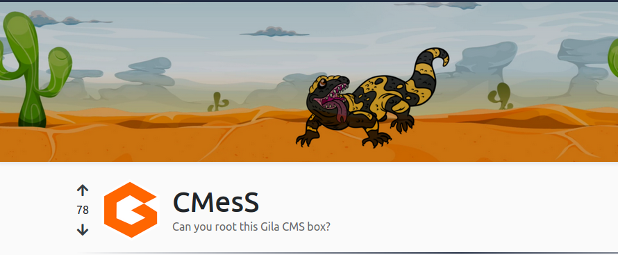
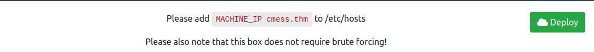

Let's start the scanning process with nmap. The IP address would be different when you deploy it:
```bash
nmap -sTV -n -sC -T4 -p- 10.10.227.177 --open
```
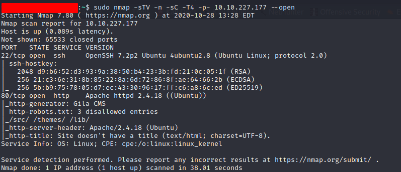

Let's also run the vulnerability scripts as well:
```bash
nmap --script vuln -p 22,80 10.10.227.177
```
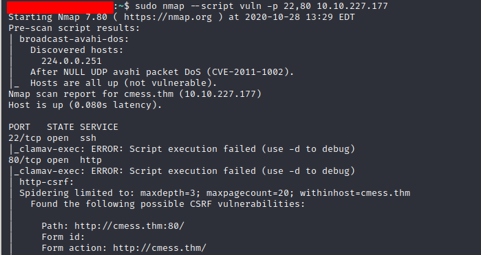

However, nmap vuln scan didn't reveal much. Since port 80 is open and Apache httpd 2.4.18 is running, we can start a directory search:
```bash
dirsearch -u http://10.10.227.177 -e php,cgi,html,htm,bak,old,txt -r
```
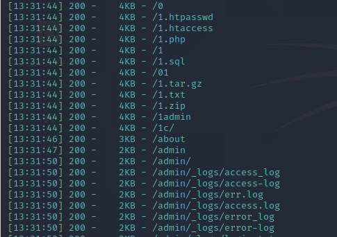
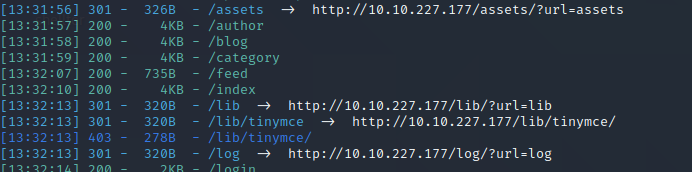

After enumerating every folder, I realized that a valid set of credentials required to get into this application:

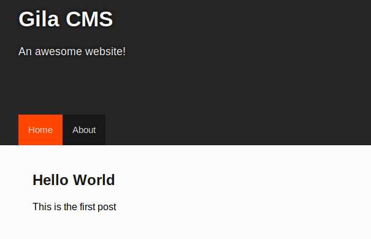
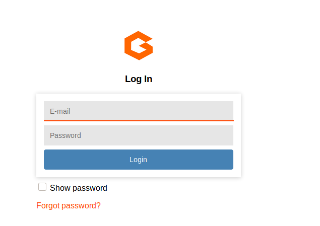

It looks like we have exhausted every option, on my end I also went through every Github exploit related to Apache 2.4.18 (Ubuntu). Next option is to look for subdomains:
```bash
wfuzz -c -w /usr/share/seclists/Discovery/DNS/subdomains-top1million-5000.txt --hl 107 -H "Host: FUZZ.cmess.thm" -u http://cmess.thm -t 100
```
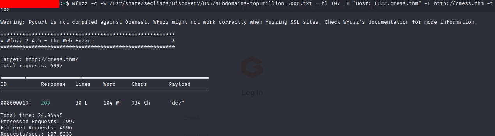

As we can see there is another domain "dev", let's add that to our /etc/hosts file and try to visit the site:

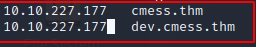

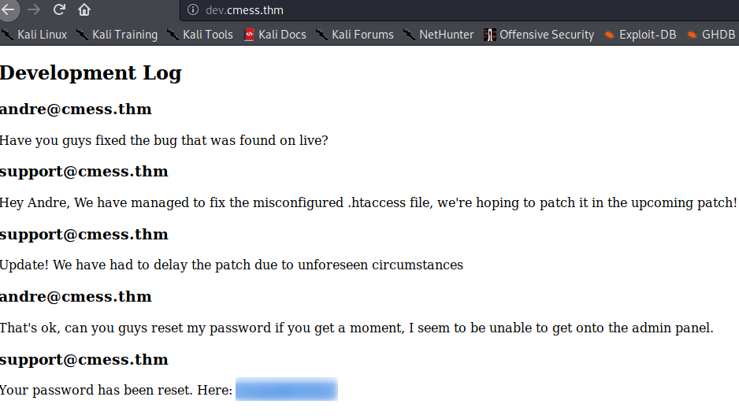

Now, we can try to use andre@cmess.thm email with the above (blurred) password. Once we login, we can browse to "Content" --> "Media" to see if we can upload a reverse shell:

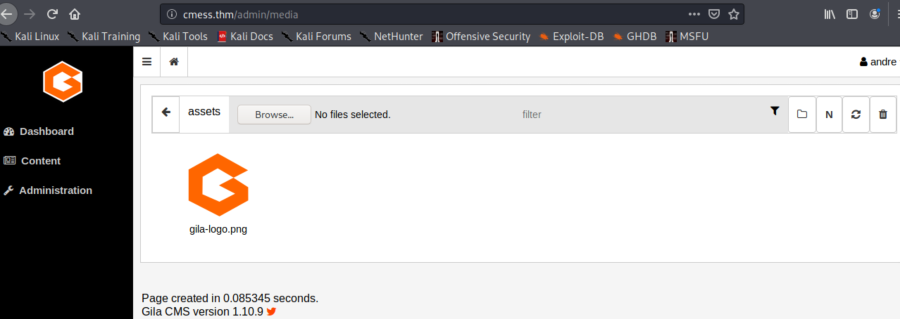

We can upload a txt file to see if there is a file type restriction for upload and then intercept the traffic with BurpSuite:

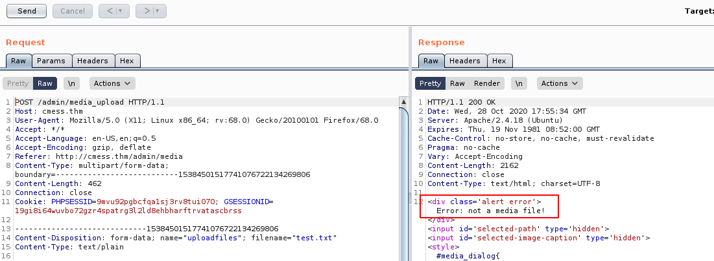

And it looks like, we can only upload media files. Let's think about it for a second, we can upload png, jpeg, jpg, or gif so how do we do that? Let's download PHP reverse shell from https://github.com/pentestmonkey/php-reverse-shell and we need to change the IP address, and port if you would like. Now, change the file extension to gif:
```bash
cp php-revshell.php php-revshell.php.gif
```
Upload it to the website, but intercept it with BurpSuite and add "GIF89a;" on the top of PHP code:

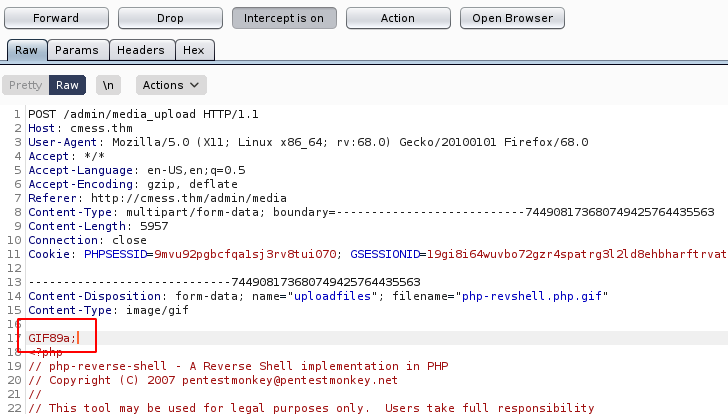

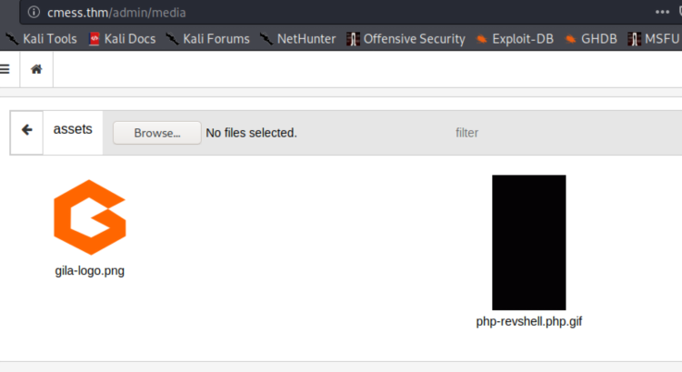

Let's change the file name to "php-revshell.php" on the Gila site:

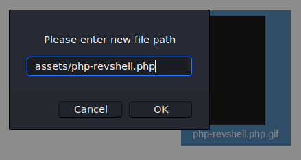

Turn off the proxy and start a netcat listener on our Kali machine ```nc -nlvp 1234``` Now, all we need to do this is visiting cmess.thm/assets/php-revshell.php If all goes well, we should receive a reverse shell back:

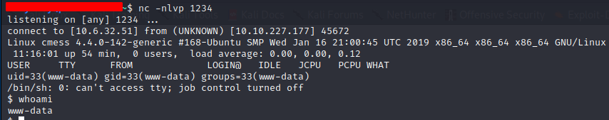
