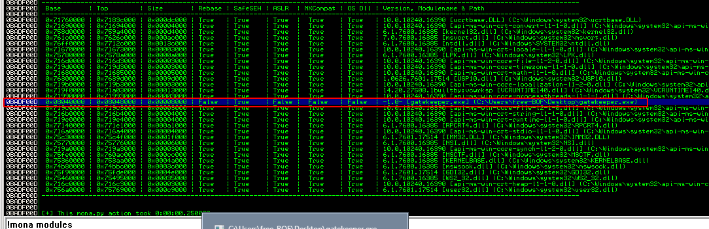
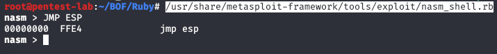
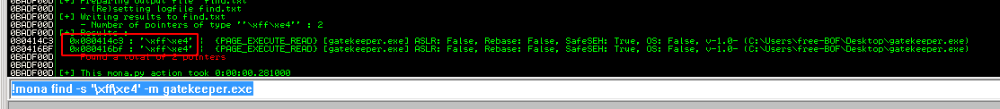

We also need to find where the jump occurs when the our exe file is loaded. First, let's restart the debugger and look for loaded modules:



We need to know the hex value of JMP command so we can look for it within gatekeeper.exe:



We don't see any other DLLs being used by gatekeeper.exe so let's look for JMP command in our program:



As we can see we have two candidates:
```bash
0x080414c3
0x080416bf
```
In the next step, we can try the first base address to see whether or not we can own EIP.

[<= Go Back to Gatekeeper Menu](GatekeeperMain.md)

[<= Go Back to BOF Menu](BOFMain.md)

[<= Go Back to Main Menu](index.md)
