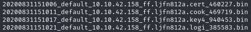
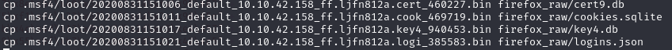
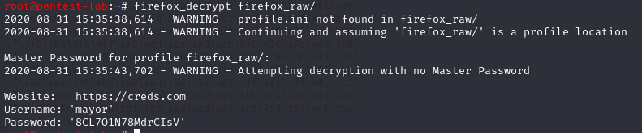

For decrypting Firefox credentials, we'll be using [firefox_decrypt](https://github.com/unode/firefox_decrypt) since we know we have 4 bin files:



We have to rename these four bin files as follow:

Bin Files | New Name
--------- | ---------
20200831151006_default_10.10.42.158_ff.ljfn812a.cert_460227.bin | cert9.db
20200831151011_default_10.10.42.158_ff.ljfn812a.cook_469719.bin | cookies.sqlite
20200831151017_default_10.10.42.158_ff.ljfn812a.key4_940453.bin | key4.db
20200831151021_default_10.10.42.158_ff.ljfn812a.logi_385583.bin | logins.json


Let's save these files to a new file called "firefox_raw":



Now, we can run our Python script
```
firefox_decrypt firefox_raw/
```


As we can see we have a usernaem and password, let's see what we can do with these..

[<= Go Back to BOF Menu](bufferoverflows.md)

[<= Go Back to Main Menu](index.md)
