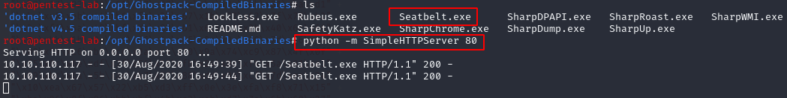
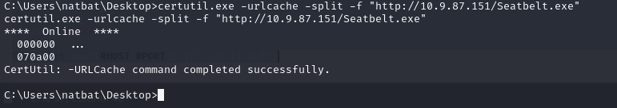

Now, we are in the machine we can look for a user flag. Since we are in Desktop, let's see what we can find here:


It looks like there is a file called "user.txt.txt", let's read content of this file with type command:
```bash
type user.txt.txt
```


Nice, we have just captured our first flag, let's put this into THM and claim our points.

We also need to capture the root flag as well, but since we don't have adequate privileges as a normal user, we need to find a way to do it. Let's use a program called Seatbelt to help us:

I already have Seatbelt.exe on my Kali machine so let's start a Python server on the Kali machine and on the compromised machine we can certuti.exe to download the file:





[<= Go Back to BOF Menu](bufferoverflows.md)

[<= Go Back to Main Menu](index.md)
