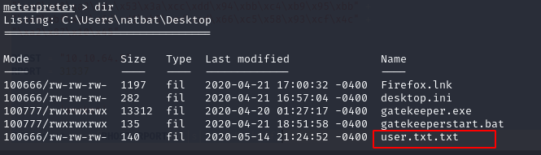

Now, we are in the machine we can look for a user flag. Since we are in Desktop, let's see what we can find here:



It looks like there is a file called "user.txt.txt", let's read content of this file with type command:
```bash
cat user.txt.txt
```


Nice, we have just captured our first flag, let's put this into THM and claim our points.

We also need to capture the root flag as well, but since we don't have adequate privileges as a normal user, we need to find a way to do it. Let's look for applications to see if anything cacthes our interest:


Looks like we have "Mozilla Firefox" running, can we gather any existing? We can try to run ```post/multi/gather/firefox_creds``` from meterpreter to see if we can find anything:


Great!.. it looks like meterpreter found and put 4 files into the root directory.

[<= Go Back to BOF Menu](bufferoverflows.md)

[<= Go Back to Main Menu](index.md)
