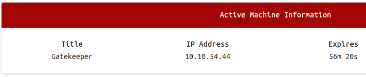

We'll see the IP address after deploying the machine which is 10.10.54.44, this may be a different in your case.


Now, let's perform an nmap scan and save the results to an XML file called gatekeeper.xml
```bash
nmap -sS -sV -n -oX gatekeeper.xml 10.10.54.44
```
We can also convert XML to HTML with a simple command.
```bash
xsltproc gatekeeper.xml -o gatekeeper.html
```
We can now open gatekeeper.html and look at the scan results.


It is obvious that SMB is open and also there is a service called "Elite" running on port 31337. Hhhmmm, it looks a bit suspicious. Let's see if there is a null session vulnurability exist.
```bash
smbclient -L 10.10.54.44 -N
```


Let's see if we can log into "Users" share and enumerate more.
```bash
smbclient \\\\10.10.54.44\\Users
```
Ater the successful login, we can go to "Share" folder. There is an EXE file called "gatekeeper.exe", what a coincident, hah. Since we know that this is a BOF challenge, we need to download gatekeeper.exe and examine to see if we can somehow exploit it.


Now, we need to copy this file to a 32 bit Windows machine and carry on with the next steps!
I promise it will be so much fun.

[<= Go Back to Gatekeeper Menu](GatekeeperMain.md)

[<= Go Back to BOF Menu](BOFMain.md)

[<= Go Back to Main Menu](index.md)
