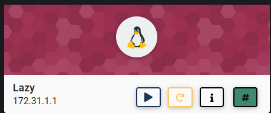
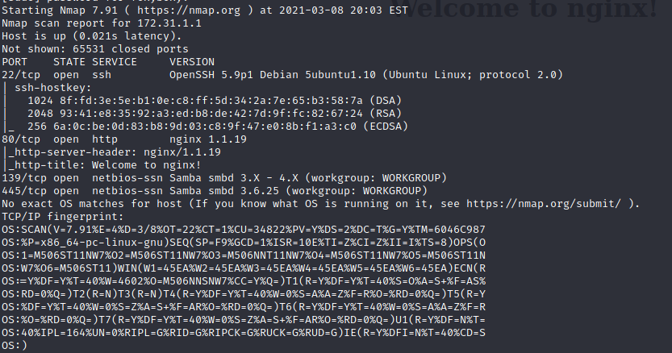
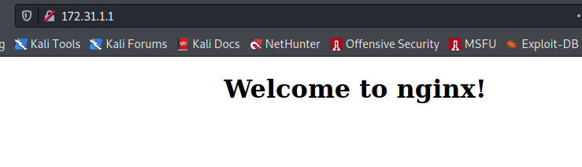
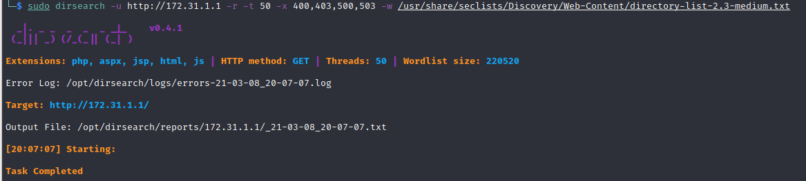
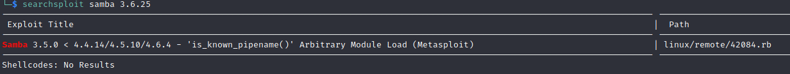
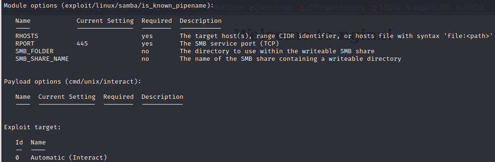
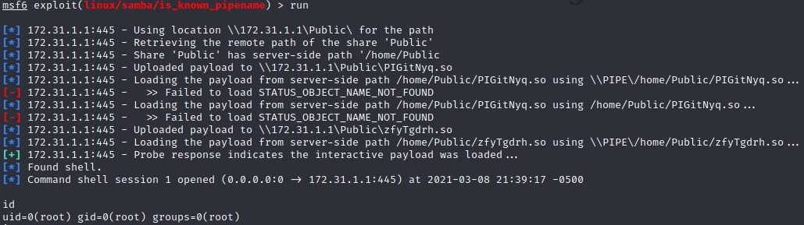

In this walkthrough, we'll go over a beginner level box called ***Sam*** on [Cyberseclabs.co.uk](https://www.cyberseclabs.co.uk).



Let's start the scanning process with nmap:
```bash
nmap -A -T4 -p- 172.31.1.1
```


We have two important findings such as port 80 and SMB ports 139,445. At first look, the port 80 directs us to "Welcome to nginx!" banner:


We can run dirsearch on it `dirsearch -u http://172.31.1.1 -r -t 50 -x 400,403,500,503 -w /usr/share/seclists/Discovery/Web-Content/directory-list-2.3-medium.txt`:


It looks like there aren't any directories found by dirsearch. Now we can search for samba 3.26.5 exploits since it is running on this machine. Searchsploit comes back with a valid exploit:


We can use a Metasploit module ***is_known_pipename*** and run to get a root shell:



I hope you enjoyed this walkthrough..

Thank you for reading...

[<= Go Back to Cyberseclabs Walkthrouhgs](CyberseclabsWalkthroughs.md)

[<= Go Back to Main Menu](index.md)
